Изготовить печатную плату в домашних условиях не так сложно, главное иметь под рукой все необходимые материалы и следовать инструкции.

Радиолюбители обычно изготавливают платы в домашних условиях двумя методами: ЛУТ(лазерно утюжная технология) и фоторезист.

Фоторезист в отличии от ЛУТ более надежный метод, с помощью которого можно изготовить печатные платы практически заводского качества. На первый взгляд для фоторезиста надо подготовить кучу инструментов и сделать много действий, но поверьте оно того стоит. Только с помощью фоторезиста вы сможете делать платы с самыми тонкими дорожками.

## Почему не ЛУТ?

ЛУТ это устаревшая технология. Для ЛУТ нужно гораздо меньше материалов чем для фоторезиста, но зато имеется больше "плавающих факторов". Для ЛУТ нужно очень кропотливо подбирать: тонер, фотобумагу, температуру утюга и время проявки платы. Любое нарушение приведет к тому что плата просто не получиться. Как бы вы не старались с помощью ЛУТ у вас не получаться платы такого же качества как с помощью фоторезиста.

## Почему не pcbway?

В настоящее время платы не обязательно изготавливать дома, можно их заказать на сервисах наподобие https://www.pcbway.ru . Но, что мне всегда не нравилось в таких сервисах:

1. Плата все равно обойдется вам дороже, чем при домашнем изготовлении;
2. Вам изготовят как минимум 5 штук вашей платы. Для тестового образца это многовато.
3. Доставка все равно займет какое-то время, обычно около двух недель.

## Нужно ли покрывать плату паяльной маской?

Однокомпонентная паяльная маска это специальное химическое соединение которое затвердевает под УФ-излучением, его наносят очень тонким слоем на печатную плату. Паяльная маска защищает медные дорожки на вашей плате от влаги и высоких температур. Делать паяльную маску не обязательно, но в таком случае вам нужно будет как-то иначе защитить медные дорожки от окисления (например пролудить оловом и нанести специальный изоляционный лак).

Если вы все таки решили делать плату с паяльной маской, то вам потребуется дополнительный фотошаблон, на котором будут размещены контакты для пайки. Далее будет описано как подготовить такой фотошаблон.

## Список необходимых материалов

1. Прозрачная пленка для печати (например [Lomond PE DS Film 0701415](https://www.dns-shop.ru/product/25c8fececab73120/plenka-prozracnaa-lomond-pe-ds-film-0701415/));
2. Лазерный принтер;
3. Фоторезистивная пленка;
4. Скотч;
5. Кисточка (средних размеров);
6. УФ-лампа для засветки (можно изготовить свою лампу из LED-ленты [5050SMD black PCB + 100cm + non waterproof](https://aliexpress.ru/item/32666450049.html));
7. Кусочек стекла (или оргстекла);
8. Кальцинированная сода;
9. Фольгированный стеклотекстолит;
10. Раствор для травления платы (Перекись водорода, Лимонная кислота, Соль);
11. Утюг;
12. Однокомпонентная паяльная маска [MECHANIC UVH900](https://aliexpress.ru/item/4000055016905.html).

## Шаг 1. Подготовка фотошаблона

Для проектирования плат я использую программу [EasyEDA](https://easyeda.com/). На мой взгляд это одна из лучших программ для полного цикла проектирования печатных плат.

Обычно сначала в EasyEDA рисуют схему вашего устройства. Когда схема готова ее преобразуют в печатную плату. Я не буду здесь рассказывать как работать в EasyEDA, представим что у вас уже есть готовый макет печатной платы сделанный в EasyEDA.

Если вы разводите одностороннюю печатную плату обязательно используйте нижний слой и проверьте отображение в 3D. Дорожки и медный слой на вашей плате будут отображаться синим цветом.

Наша схема готова, теперь ее нужно экспортировать в PDF.

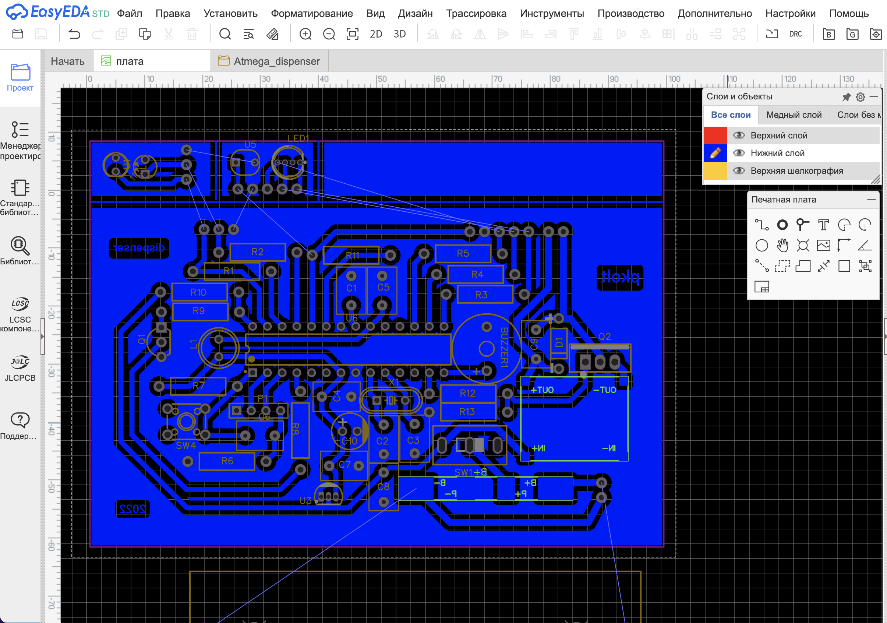

### Экспортируем в PDF фотошаблон платы

В верхнем меню выбираем: **Файл -> Экспорт -> PDF**.

Указываем цвет: **белое на черном.**

В диалоговом окне выбираем нужные слои:
- **нижний слой** (для односторонних плат);
- **границы платы;**
- **многослойная;**
- **отверстие;**

Для каждого слоя нужно проставить галочки: **экспорт** и **зеркально**.

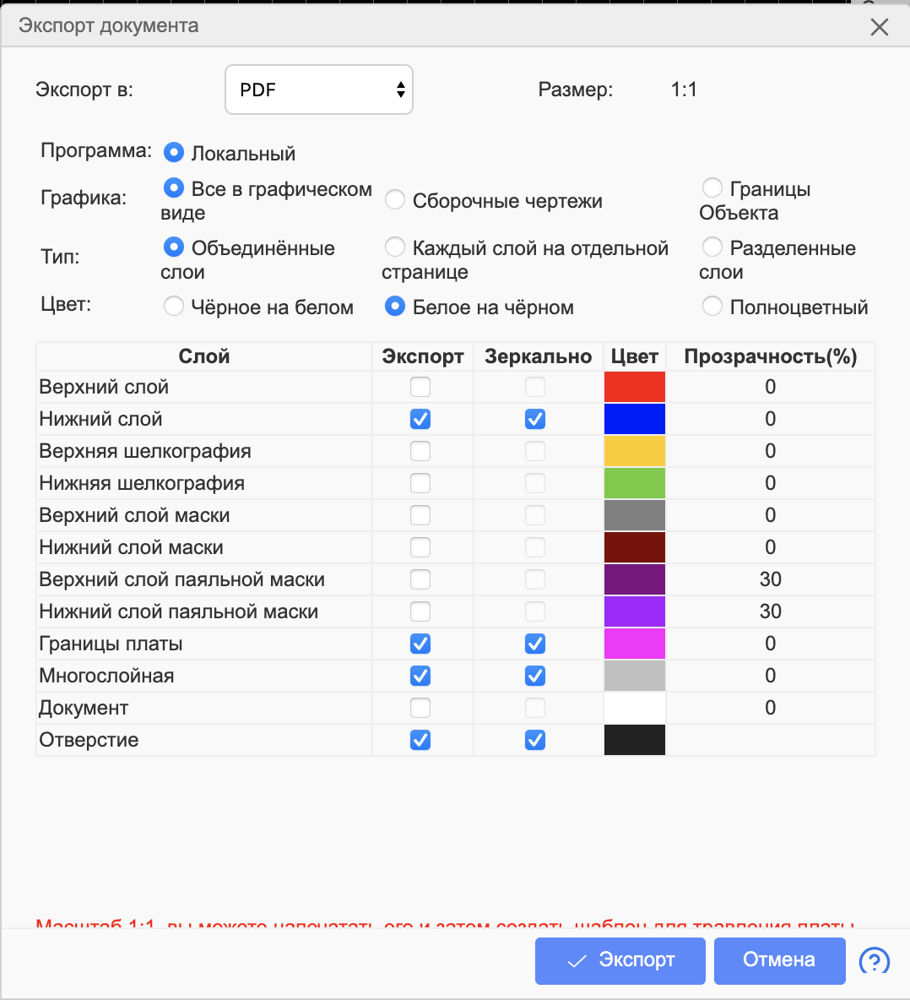

После завершения настройки нажимаем кнопку "Экспорт". Фотошаблон вашей платы будет сохранен в PDF файл.

Чтобы ничего не перепутать можно добавить в макет платы текстовые надписи. В PDF-файле текст должен отображаться в читаемом виде (не в зеркальном).

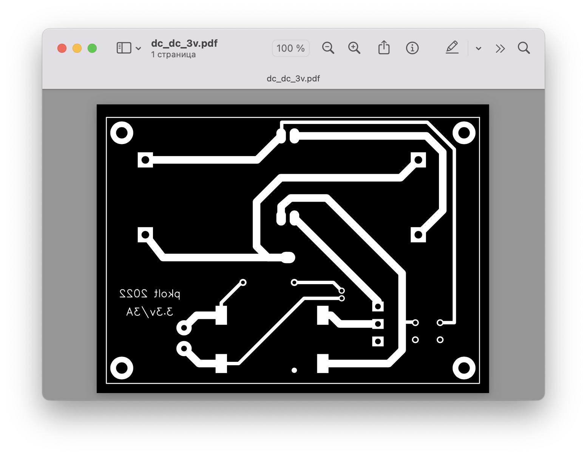

### Экспортируем в PDF фотошаблон паяльной маски

В верхнем меню выбираем: **Файл -> Экспорт -> PDF**.

Указываем цвет: **черное на белом.**

В диалоговом окне выбираем нужные слои:
- **нижний слой маски** (для односторонних плат);
- **нижний слой паяльной маски;**
- **границы платы;**

Для каждого слоя нужно проставить галочки: **экспорт** и **зеркально**.

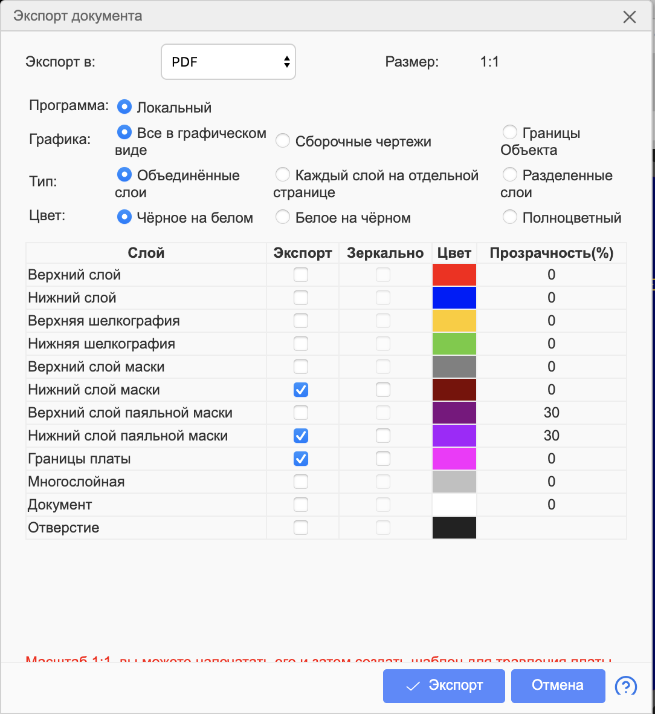

После завершения настройки нажимаем кнопку "Экспорт". Фотошаблон паяльной маски будет сохранен в PDF файл.

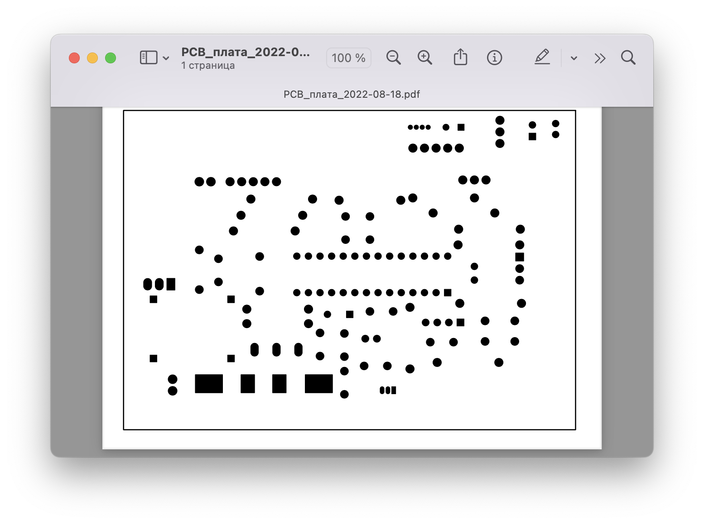

Чтобы маска получилась лучше, можно распечатать еще один шаблон паяльной маски, сняв галочки "зеркально".

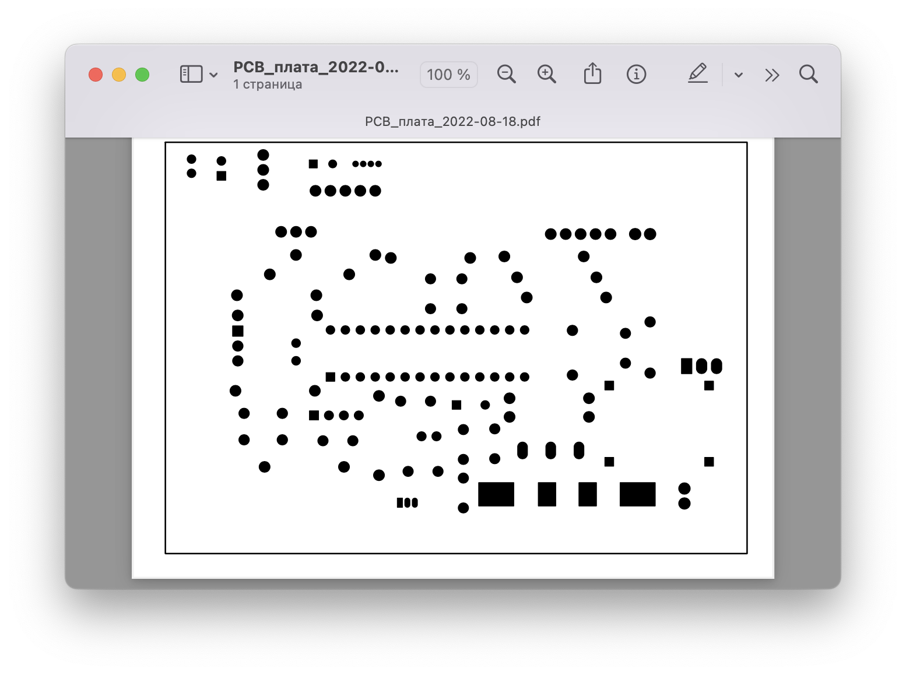

Позднее мы соединим два фотошаблона паяльной маски скотчем. Двойной шаблон лучше защитит медные контакты от засветки УФ-маски. 

Далее файл печатной платы и паяльной маски нам необходимо распечатать на прозрачной пленке Lomond.

Загружаем пленку Lomond в лазерный принтер. Используемая здесь пленка Lomond двухсторонняя, поэтому не важно какой стороной вы ее положите в лоток для бумаги принтера. Но обратите внимание что бывает и односторонняя пленка, ее нужно загружать в лоток для бумаги принтера правильной стороной.

При печати обязательно:
- укажите масштаб 100%;
- выключите экономию тонера при печати (если у вас есть такой режим);

Запускаем печать.

### Как экономно распечатать фотошаблон платы и паяльную маску на одном листе A4?

**Нам нужно объединить два PDF-файла в один.** Для таких действий есть специальные программы. Но можно это сделать это просто в одно действие.

Открываем PDF-файл с печатной платой в программе "Просмотр" (MacOS). Выбираем "Правка" -> "Вставить" -> "Страницу из файла".

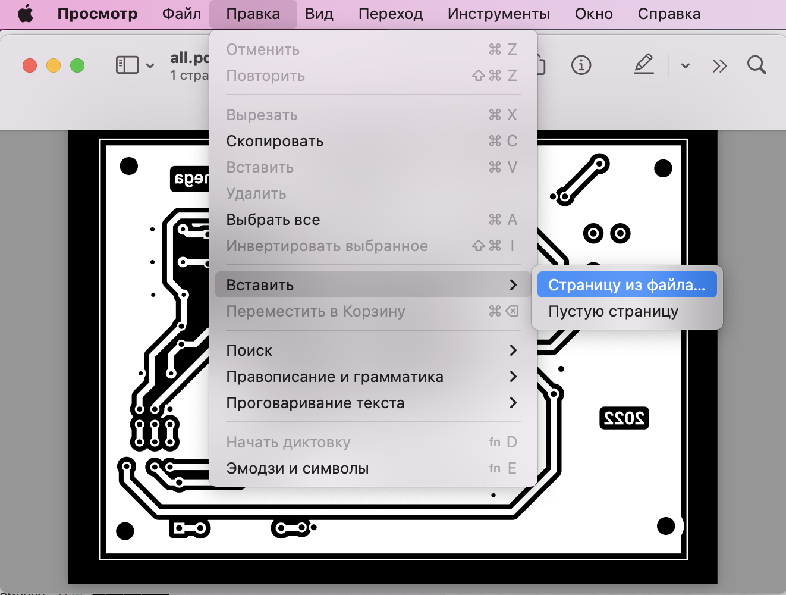

Теперь в нашем PDF-файле две страницы с печатной платой и паяльной маской.

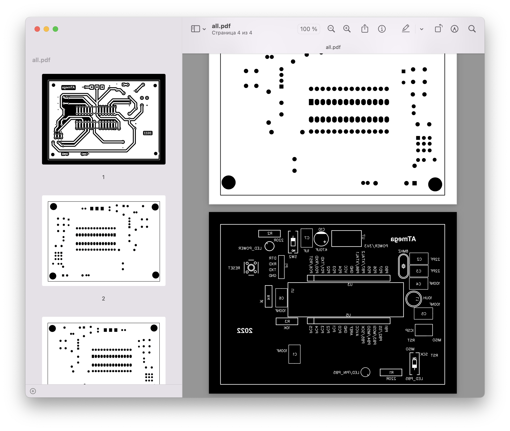

**Теперь нам нужно распечатать две страницы на одном листе A4.** Для этих целей я использую Adobe Acrobat Reader. Открываем наш файл и выводим на печать со 100% масштабом на одну страницу.

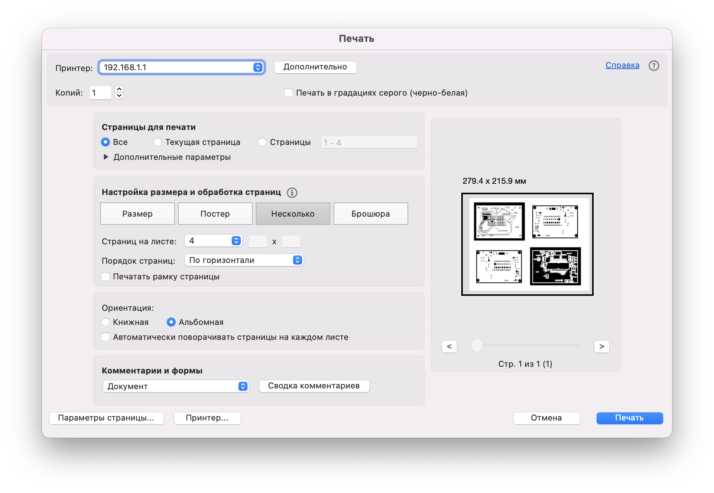

## Шаг 2. Подготовка стеклотекстолита

Обрабатываем стеклотекстолит мелкой наждачкой до блеска.

Обезжириваем с помощью средства для мытья посуды или протираем изопропиловым спиртом.

## Шаг 3. Нанесение фоторезистивной пленки на плату

Методы нанесения фоторезистивной пленки могут отличаться. Кто-то наносит пленку на стеклотекстолит в тазике с водой, чтобы лучше спозиционировать пленку. Мне кажется это большое переусложнение процесса. У меня хорошо получается наносить фоторезистивную пленку без использования воды.

При работе с фоторезистом постарайтесь закрыть окна от прямых источников солнечного света (солнечный свет содержит УФ-излучение), приглушите свет ламп. Фоторезист засвечивается не так быстро от обычного освещения, но лучше подстраховаться.

Сначала отрезаем необходимый кусочек фоторезистивной пленки. Отрезаем немного скотча. Скотч необходим чтобы разделить фоторезист на две части: клейкая часть и защитная пленка. С каждой стороны фоторезистивной пленки наклеиваем по кусочку скотча и начинаем тянуть. Обычно защитная пленка очень хорошо захватывается таким способом.

Аккуратно наклеиваем фоторезист на стеклотекстолит. Начинаем от края и идем по всей длине платы, не допуская образования пузырьков воздуха под фоторезистом. Также не допускайте попадания пыли и волос при наклеивании фоторезиста.

Отрезаем лишние кусочки фоторезиста по краям платы.

## Шаг 4. Прогрев утюгом

Берем лист А4 белой бумаги. Сгибаем его по полам. Накрываем нашу плату этим листом.

Прогреваем утюгом на минимальном режиме (1 режим) около 30 секунд, плотно прижимая лист бумаги к плате.

Если фоторезист при этом потемнеет, значит температура утюга была слишком большой.

## Шаг 5. Засветка фоторезиста УФ-лампой

Располагаем плату на ровной поверхности, накладываем фотошаблон. Я обычно делаю на фотошаблонах какую-то надпись, надпись всегда должна читаться и не быть зеркальной, по надписи всегда можно понять верно ли вы расположили фотошаблон.

Засвечиваем под УФ-лампой 4 минуты. Время засветки может быть другим, в зависимости от мощности вашей лампы и расстояния от лампы до платы.

## Шаг 6. Снимаем защитную пленку с фоторезиста

На 1 минуту закидываем плату в морозилку. Отрезаем кусочек скотча.

Достаем плату из морозилки. Приклеиваем кусочек скотча на уголок платы, тянем, отклеиваем защитную пленку с фоторезиста.

## Шаг 7. Проявка фоторезиста в кальцинированной соде

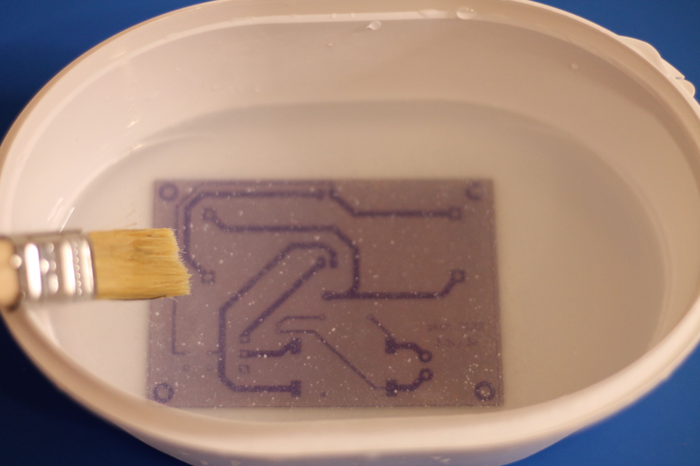

В небольшую емкость наливаем 250 мл теплой воды (можно из крана). Вода не должна быть сильно горячей, иначе пленка фоторезиста может вздуться в некоторых местах. Кидаем туда 1 чайную ложку кальцинированной соды. Перемешиваем до растворения соды.

Помещаем плату в емкость с кальцинированной содой. Кисточкой периодически помешиваем счищая остатки фоторезиста. Засвеченный фоторезист должен остаться, а не засвеченный раствориться в кальцинированной соде. Обычно на этот процесс нужно около 5-7 минут.

Периодически доставайте плату и проверяйте, как только весь фоторезист в незасвеченных местах раствориться - процесс можно завершать.

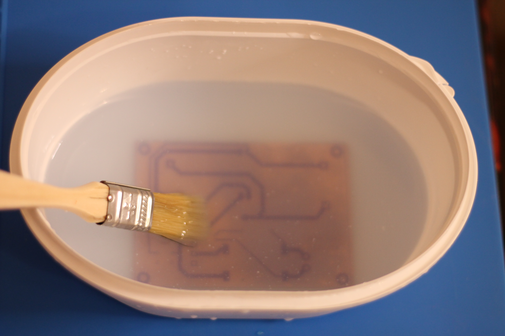

Будьте аккуратны, не спешите, если вы достанете плату раньше времени и на медных дорожках останутся кусочки фоторезиста, то плата там не протравиться.

## Шаг 8. Высушите плату

Подождите пока плата высохнет или просушите феном.

## Шаг 9. Прогрев утюгом

Накройте плату согнутым пополам листом А4.

Прогреваем утюгом на минимальном режиме (1 режим) около 5 секунд.

Это поможет лучше зафиксировать фоторезист после воды.

## Шаг 10. Травление платы

В небольшую емкость добавляем:

1. 100 мл перекиси водорода;
2. 30 г лимонной кислоты;
3. 5 г соли;

Немного трясем емкость чтобы перемешать наши реагенты.

Ни в коем случае не используйте кисточку для помешивания на этом этапе, все металлические части в этом растворе будут растворяться.

Помещаем плату в емкость.

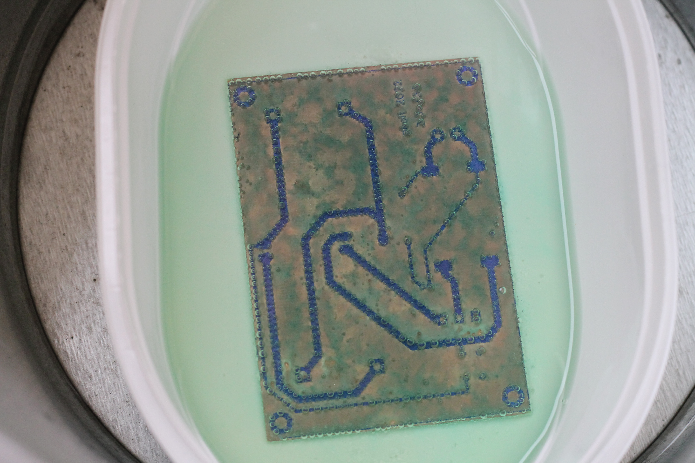

Для ускорения процесса травления можно поставить емкость на батарею или на водяную баню (железное ведро с горячей водой).

Дождитесь пока медь раствориться. Раствор при этом будет окрашиваться в зелено-синий цвет, выделяя пузырьки с газом. Выделяемые газы не такие опасные как при травлении в хлорном железе, но лучше вынести это на балкон или открыть форточку.

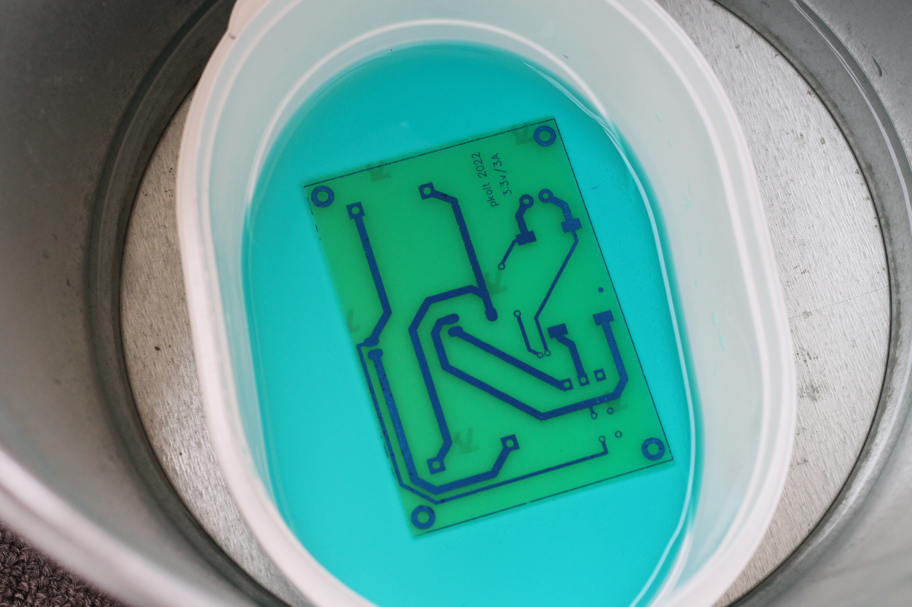

По готовности, промываем плату в воде, раствор выливаем в унитаз.

## Шаг 11. Смываем фоторезист

В небольшую емкость наливаем 250 мл горячей воды (можно из крана). На этом этапе воду можно сделать погорячее, это нам поможет быстрее снять пленку фоторезиста. Кидаем туда 2-3 чайные ложки кальцинированной соды. Перемешиваем до растворения соды.

Помещаем плату в емкость с кальцинированной содой. Оставляем на 2-3 часа до полного растворения фоторезиста.

Если фоторезист почти растворился, но небольшие фрагменты платы остались с фоторезистом, можно его смыть спиртом (например, изопропиловым спиртом).

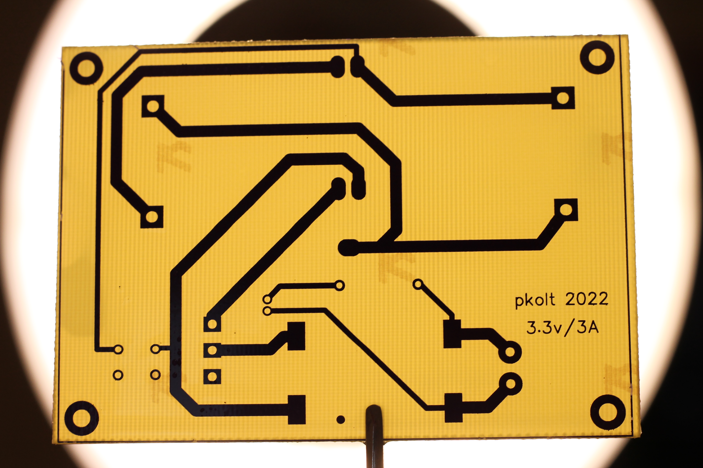

## Шаг 12. Покрываем плату защитной УФ-маской

Фиксируем плату скотчем на резиновом коврике. Скотч с такого коврика в конце можно будет очень легко удалить.

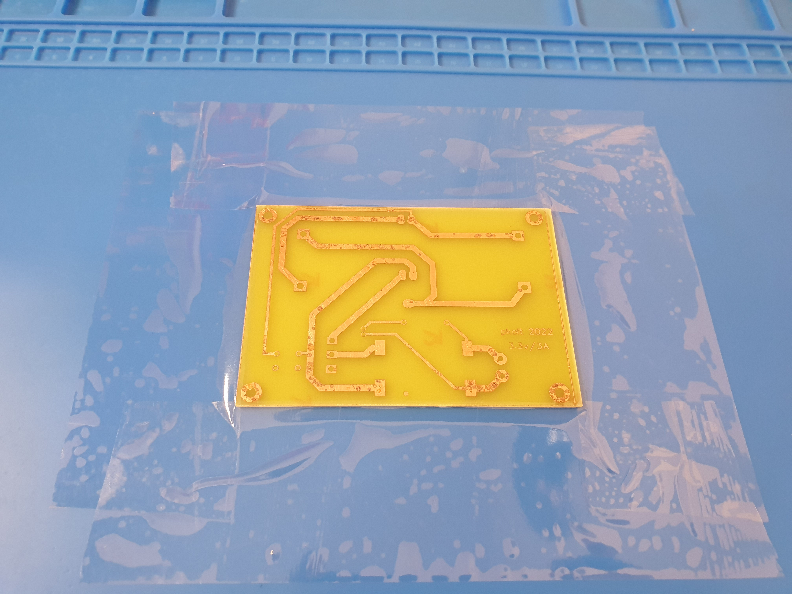

Наносим на плату маску [MECHANIC UVH900](https://aliexpress.ru/item/4000055016905.html). Количество маски зависит от размеров вашей платы, но слишком много наносить не нужно, маска будет на плате очень тонким слоем.

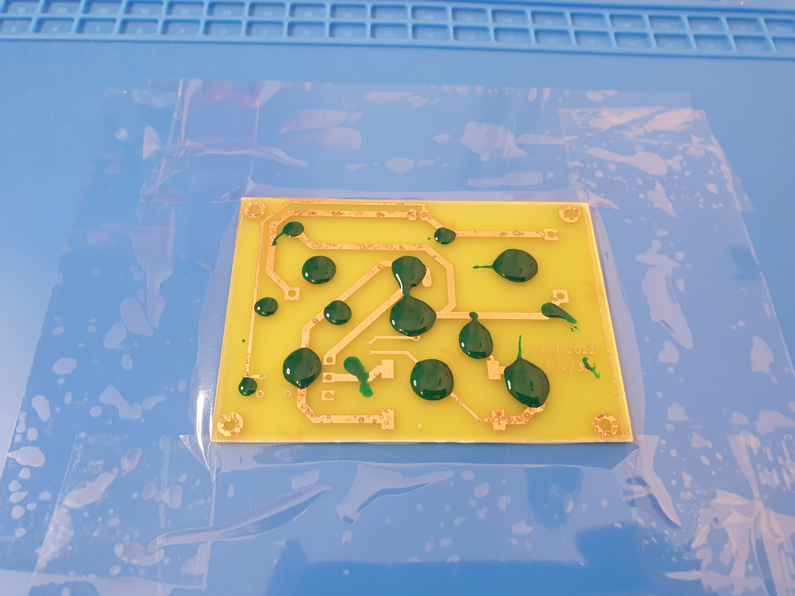

Сверху накрываем плату тонкой пленкой. Я использую пленку из файлов (канцелярские файлы для документов). Только выбирайте файлы без рисунка, на вид они похожи на упаковочную пленку для цветов.

Не советую использовать пленку для фотопечати на которой мы делали фотошаблон, она очень толстая и к ней хорошо прилипает УФ-маска, отделить ее от платы после застывания УФ-маски будет проблематично.

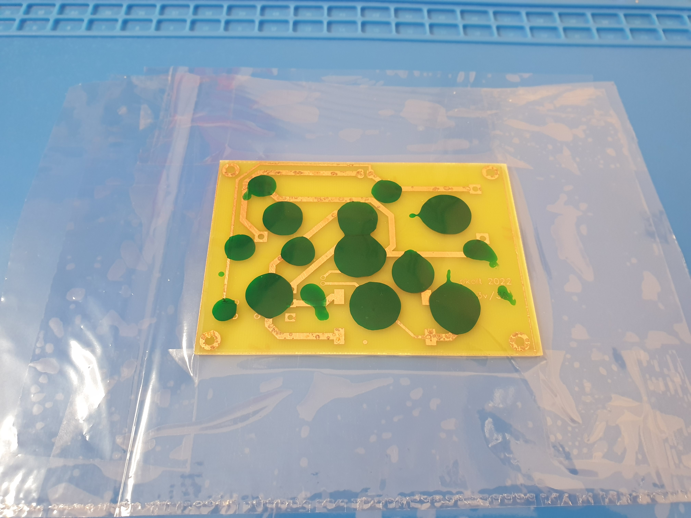

Пластиковой картой равномерно распределяем УФ-маску по плате. Слой должен быть очень тонким - должен просвечивать. 

Я читал много негативных отзывов об маске [MECHANIC UVH900](https://aliexpress.ru/item/4000055016905.html) и первый раз у меня тоже не получилась плата при ее использовании. Секрет этой маски очень простой - ее нужно наносить очень тонким слоем, если слой будет толстый, то маска просто не застынет под УФ-облучении. Нагревать эту маску не нужно, это мне подтвердил продавец на Aliexpress.

Вообщем маска у вас должна быть очень тонким слоем.

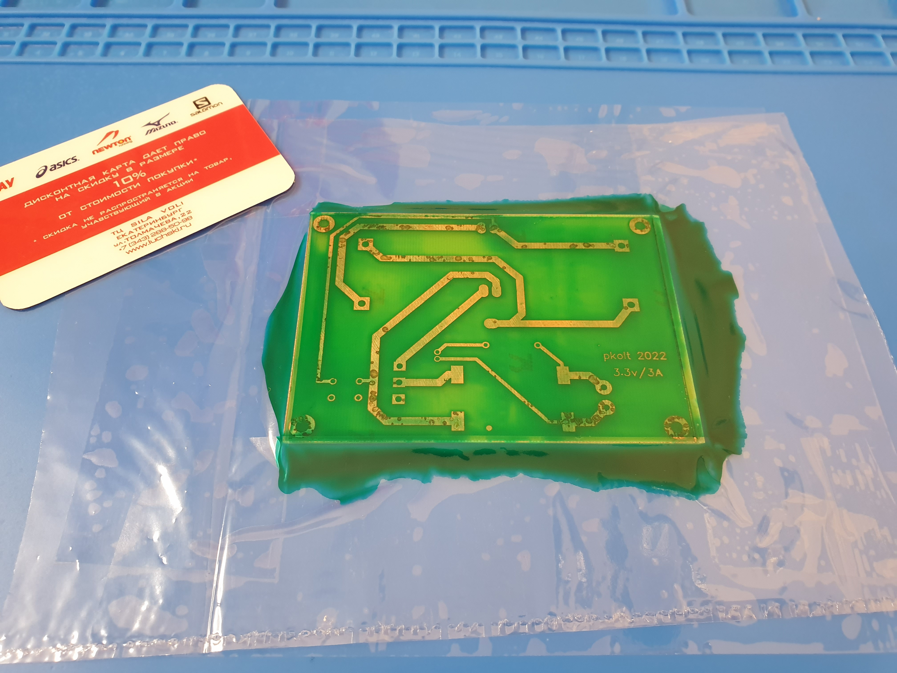

Поверх платы располагаем фотошаблон для маски. Я рекомендую использовать двойной фотошаблон, даже если ваш принтер печатает очень хорошо, одного слоя тонера будет недостаточно чтобы качественно засветить маску.

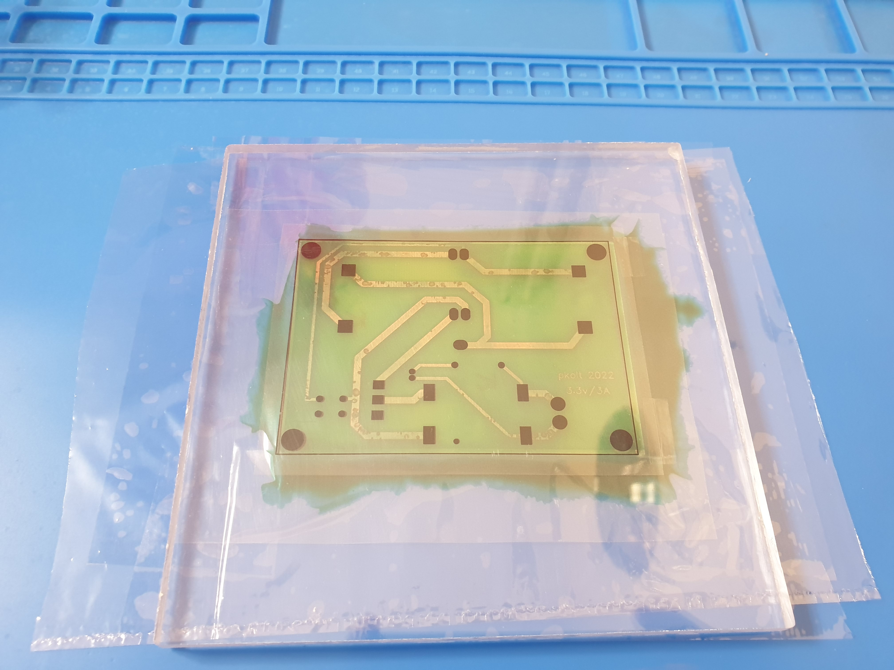

Засвечиваем нашу маску УФ-лампой. Я ставлю лампу как можно ближе к плате, оставляю засвечиваться на 30 минут (ваше время засветки может отличаться в зависимости от мощности УФ-лампы).

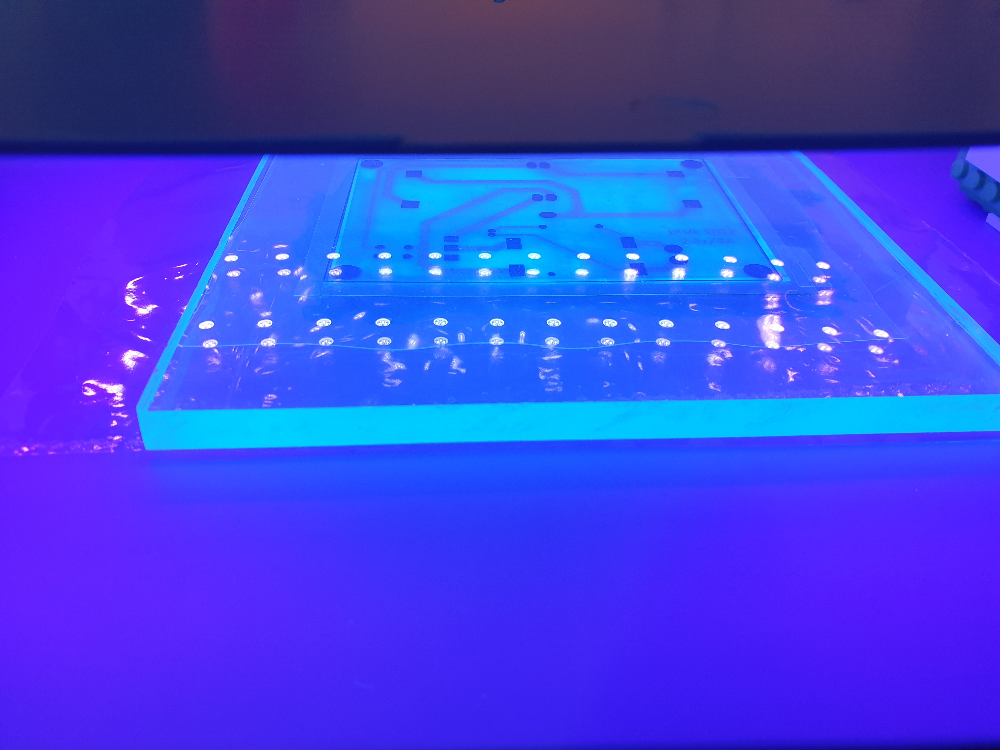

Снимаем пленку, если маска застыла как нужно, пленка снимается очень легко. Излишки маски остаются на скотче, также рекомендую пользоваться перчатками. Маска [MECHANIC UVH900](https://aliexpress.ru/item/4000055016905.html) практически не смывается водой, если вы испачкали руки стереть ее можно спиртом (например изопропиловым).

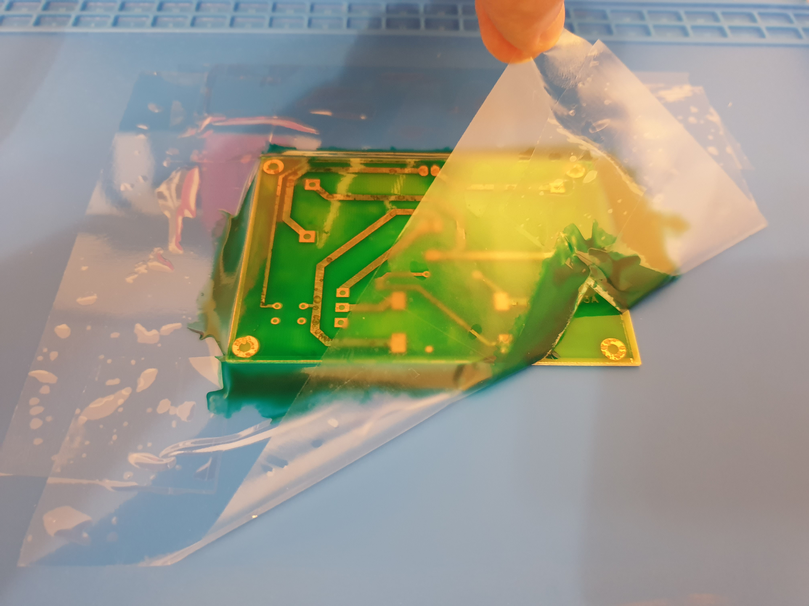

Ватной палочкой счищаем места для пайки (те что были закрыты маской). Я не рекомендую смачивать ватную палочку спиртом как делают некоторые, т.к. спирт на этом этапе может растворить часть верхнего слоя платы, сделав его не глянцевым, а матовым.

Очень тщательно сотрите маску на контактах, пройдитесь чистой палочкой в конце процесса чтобы убедиться что маски не осталось на контактах, иначе припаять компоненты в этих местах будет сложно.

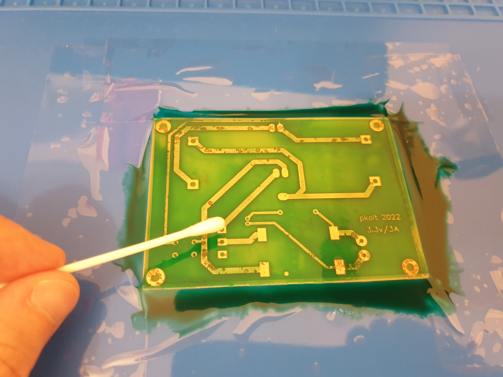

Отправляем плату на закрепляющее застывание под УФ-лампой на 30 минут.

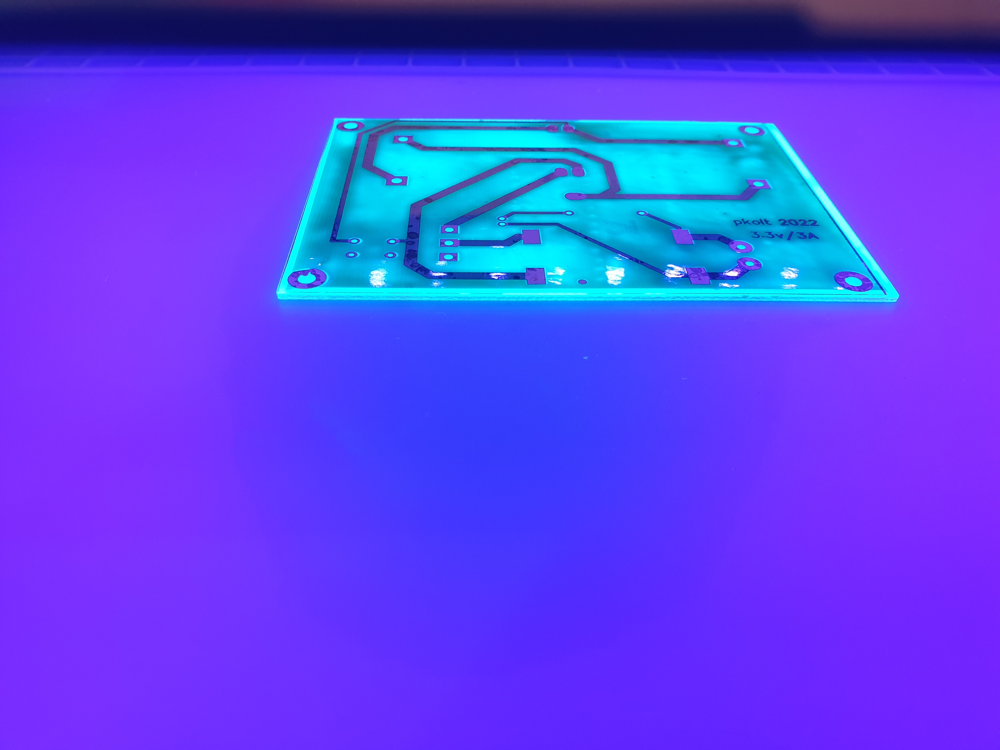

Маска высохла. Опытным путем в дальнейшем вы можете определить слой наносимой маски, если вам кажется что слой слишком тонкий. Даже такой тонкий слой хорошо защитить плату от влаги и отслаиванию дорожек при перегреве паяльником.

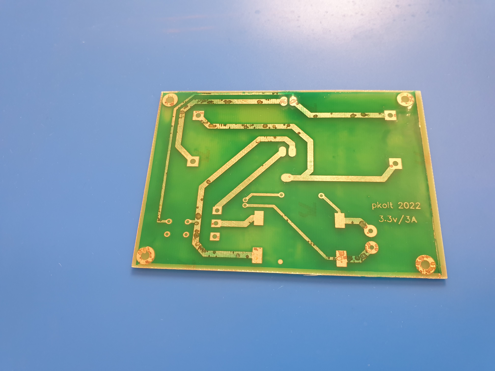

## Шаг 13. Сверлим отверстия

Если вы используете DIP-компоненты, то вам необходимо просверлить отверстия для компонентов на вашей плате. Размеры отверстий можно посмотреть в EasyEDA.

Сверла по металлу очень плохо берут текстолитовые платы, рекомендую к покупке специальные [сверла на Aliexpress](https://aliexpress.ru/item/4000850660112.html).

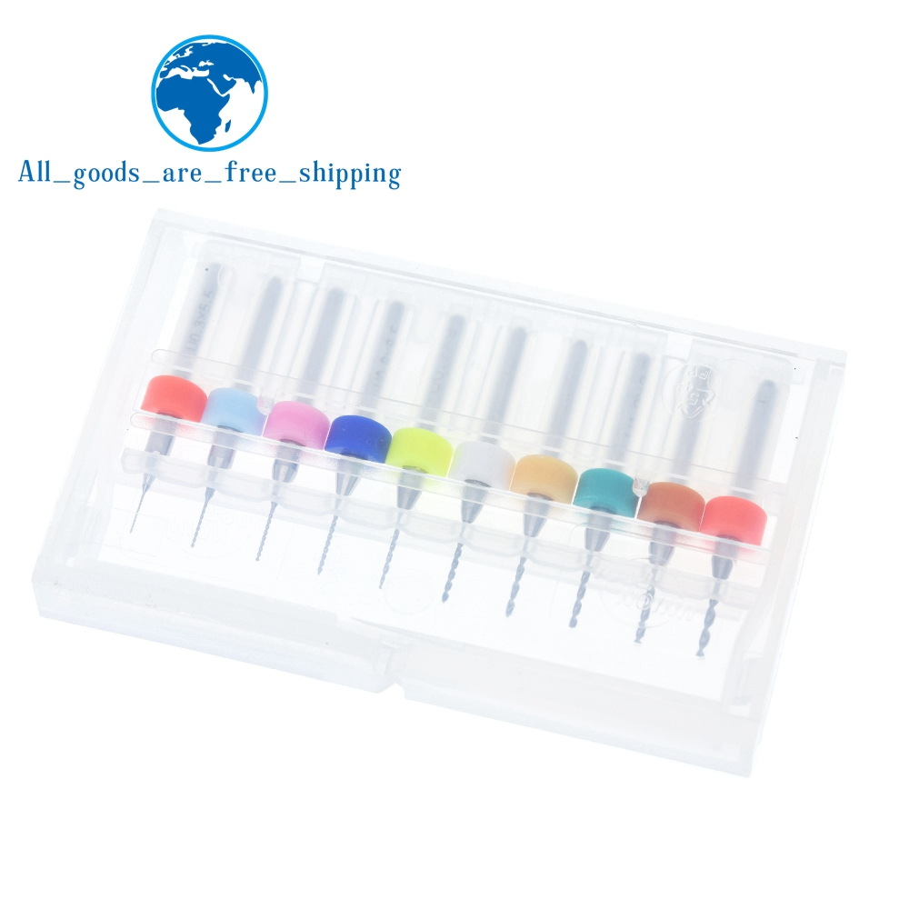

## Шаг 14. Припаиваем компоненты

Припаиваем наши компоненты на плату согласно схеме в EasyEDA. Если вы используете жидкий флюс на спиртовой основе не забудьте его смыть по завершению процесса. Смыть флюс можно например с помощью изопропилового спирта.