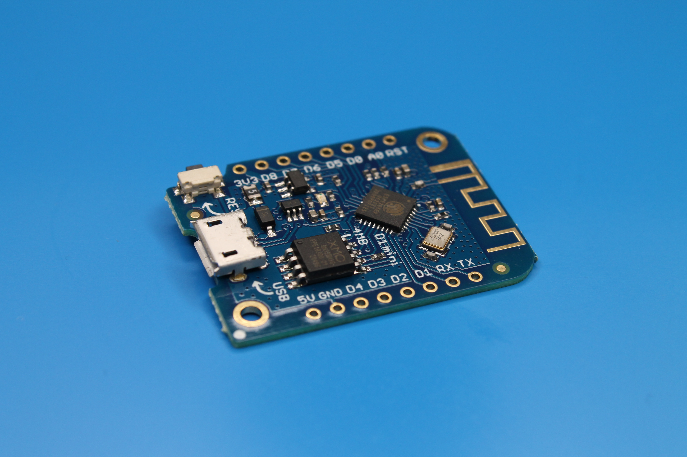
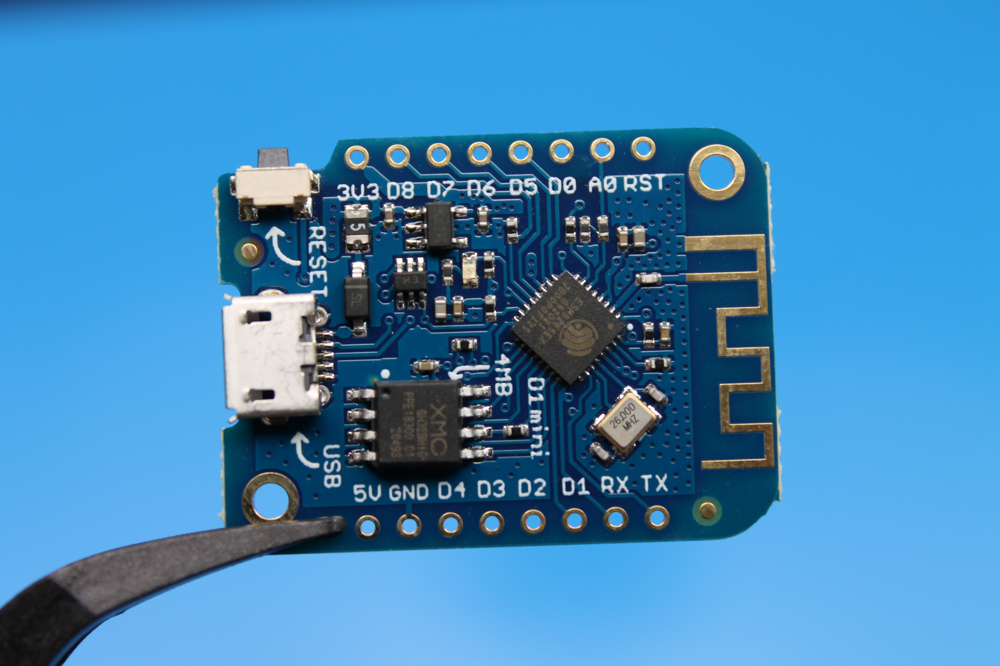
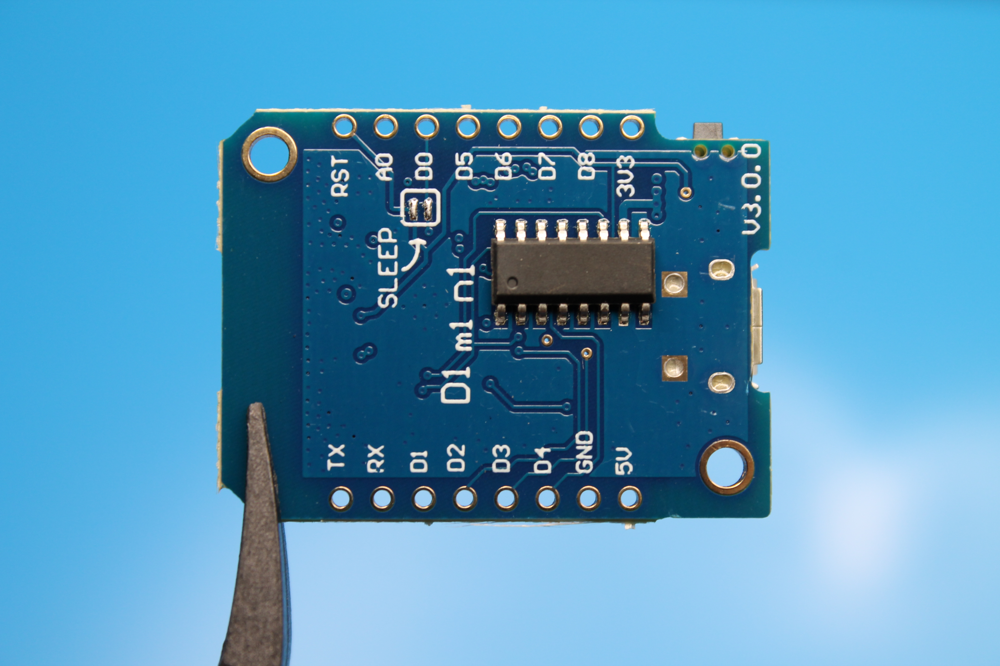

**Wemos D1 mini** - недорогая, Arduino-совместимая, миниатюрная плата для создания устройств интернета вещей от компании [WEMOS Electronics](https://www.wemos.cc/en/latest/d1/d1_mini.html).




## Технические характеристики

| Свойство                                 | Значение                                  |
|------------------------------------------|-------------------------------------------|
| Микроконтроллер                          | ESP-8266EX                                |
| Питание платы                            | 3.3 V (только через стабилизатор) или 5 V |
| Рабочее напряжение                       | 3.3 V                                     |
| Кол-во цифровых контактов ввода-вывода   | 11                                        |
| Кол-во ШИМ контактов                     | 4                                         |
| UART                                     | 1                                         |
| SPI                                      | 1                                         |
| I2C                                      | 1                                         |
| Кол-во аналоговых входов                 | 1 (максимальное напряжение 3.2 V)         |
| Внешние прерывания                       | 10 (все цифровые контакты кроме GPIO16)   |
| Постоянный ток на контактах ввода-вывода | -                                         |
| Флеш память (для записи программ)        | 4 Mb                                      |
| SRAM                                     | -                                         |
| EEPROM                                   | -                                         |
| Тактовая частота                         | 80/160 MHz                                |

## Питание

Есть несколько способов которыми можно запитать плату Wemos D1 mini:

1) Через microUSB. Ток проходит через встроенный регулятор RT9013 и понижается до рабочего 3.3 V .

2) Через контакты **5V** и **GND**. Можно запитать током в диапазоне 2.2-5.5 V, встроенный регулятор RT9013 понизит напряжение до рабочего 3.3 V .

3) Через контакты **3V3** и **GND**. Для этого вам придется использовать свой внешний регулятор напряжения (или DC-DC преобразователь), значение напряжения должно быть 3.3 V . Ни в коем случае не подключайте эти контакты напрямую к источнику питания (так как при этом не используется внутренний регулятор напряжения).

## Контакты ввода - вывода



| Pin | Pin ESP-8266EX | Описание                                                           |
|-----|----------------|--------------------------------------------------------------------|
| TX  | TXD            | TXD (UART)                                                         |
| RX  | RXD            | RXD (UART)                                                         |
| A0  | A0             | Аналоговый вход, максимальное напряжение 3.2 V                     |
| D0  | GPIO16         | IO (Цифровой вход/выход)                                           |
| D1  | GPIO5          | IO / SCL (I2C)                                                     |
| D2  | GPIO4          | IO / PWM / SDA (I2C)                                               |
| D3  | GPIO0          | IO / При INPUT_PULLUP подтянут 10K резистором к Vcc                |
| D4  | GPIO2          | IO / При INPUT_PULLUP подтянут 10K резистором к Vcc / BUILTIN_LED  |
| D5  | GPIO14         | IO / PWM / SCK (SPI)                                               |
| D6  | GPIO12         | IO / PWM / MISO (SPI)                                              |
| D7  | GPIO13         | IO / MOSI (SPI)                                                    |
| D8  | GPIO15         | IO / PWM / SS (SPI) / При INPUT_PULLUP стянут 10K резистором к GND |
| GND | GND            | Земля                                                              |
| 5V  | -              | Питание 5 V                                                        |
| 3V3 | 3.3V           | Питание 3.3 V                                                      |
| RST | RST            | Сброс                                                              |



## Добавление поддержки платы Wemos D1 mini в Arduino IDE

1. Запустить Arduino IDE;
2. Arduino -> Preferences -> Доп. ссылки для менеджера плат;
3. Добавить новую ссылку на плату `https://arduino.esp8266.com/stable/package_esp8266com_index.json`;
4. Инструменты -> Плата -> Менеджер плат -> Ввести "esp8266";
5. Установить плату esp8266;

Подробнее документация - [Arduino core for ESP8266 WiFi chip](https://github.com/esp8266/Arduino).

## Моргаем встроенным светодиодом на Wemos D1 mini

Создать новый скетч в Arduino IDE с текстом программы:

```cpp
void setup() {
  pinMode(LED_BUILTIN, OUTPUT);
}

void loop() {
  digitalWrite(LED_BUILTIN, LOW);
  delay(1000);
  digitalWrite(LED_BUILTIN, HIGH);
  delay(1000);
}
```

Выбрать нужную плату: Инструменты -> Плата -> ESP8266 Boards -> LOLIN (WEMOS) D1 mini (clone).

Загрузить скетч в Wemos D1 mini.