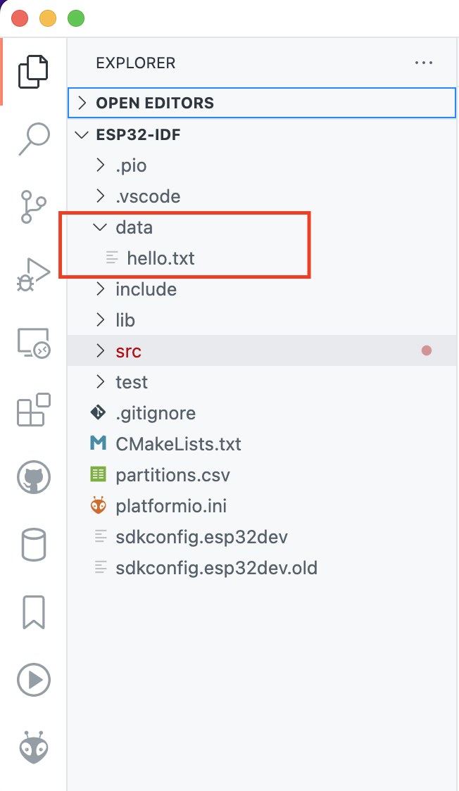
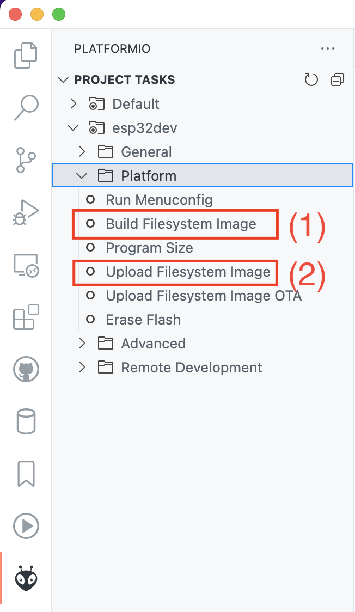

SPIFFS (serial peripheral interface flash file system) — это файловая система, предназначенная для флэш-устройств. Она поддерживает выравнивание износа, проверку целостности файловой системы и многое другое.

- Файловая система SPIFFS не поддерживает каталоги;
- Это не стек реального времени. Одна операция записи может занять гораздо больше времени, чем другая.
- На данный момент не обнаруживает и не обрабатывает плохие блоки.
- SPIFFS может надежно использовать только около 75% выделенного пространства раздела.
- Когда в файловой системе заканчивается место, сборщик мусора пытается найти свободное место, сканируя файловую систему несколько раз, что может занять до нескольких секунд на вызов функции записи, в зависимости от требуемого места.
- Удаление файла не всегда приводит к удалению всего файла, в результате чего в файловой системе остаются неиспользуемые разделы.
- Когда ESP32 испытывает потерю питания во время работы файловой системы, это может привести к повреждению SPIFFS. Однако файловая система по-прежнему может быть восстановлена с помощью `esp_spiffs_check`.

Для использования SPIFFS памяти нужно разметить ее в таблице разделов `partitions.csv`:

```txt
# ESP-IDF Partition Table
# Name,   Type, SubType, Offset,  Size, Flags
nvs,      data, nvs,     0x9000,  24K,
phy_init, data, phy,     ,        4K,
spiffs,   data, spiffs,  ,        500K,
factory,  app,  factory, ,        7600K,
```

Файл настройки PlatformIO:

```ini
[env:esp32dev]
platform = espressif32
board = esp32dev
framework = espidf
monitor_speed = 115200
monitor_filters = esp32_exception_decoder
monitor_port = /dev/cu.SLAB_USBtoUART
upload_port = /dev/cu.SLAB_USBtoUART
board_upload.flash_size = 8MB
board_upload.maximum_size=8388608
board_build.partitions = partitions.csv
```

В PlatformIO создаем каталог `data`, все что в нем будет находиться можно будет достать на ESP32 как файл. Не забываем что SPIFFS не умеет работать с каталогами, каталоги внутри каталога `data` создавать нельзя.



Для загрузки каталога его нужно сбилдить (**Platform -> Build Filesystem Image**) и загрузить в ESP32 (**Platform -> Upload Filesystem Image**).



Ниже приведен пример кода как можно считать содержимое файла из `data/hello.txt`:

```c
#include "freertos/FreeRTOS.h"
#include "esp_log.h"
#include "esp_spiffs.h"

static const char *TAG = "NVS";

void app_main(void)
{
    esp_vfs_spiffs_conf_t conf = {
        .base_path = "/spiffs",
        .partition_label = NULL,
        .max_files = 5,
        .format_if_mount_failed = true};

    ESP_ERROR_CHECK(esp_vfs_spiffs_register(&conf));
    FILE *f = fopen("/spiffs/hello.txt", "r");
    if (f == NULL)
    {
        ESP_LOGE(TAG, "Failed to open file for reading");
        return;
    }
    char line[64];
    fgets(line, sizeof(line), f);
    fclose(f);
    ESP_LOGI(TAG, "Read from file: '%s'", line);
    // All done, unmount partition and disable SPIFFS
    esp_vfs_spiffs_unregister(conf.partition_label);
}
```

Подробнее о SPIFFS можно прочитать в [документации ESP-IDF](https://docs.espressif.com/projects/esp-idf/en/latest/esp32/api-reference/storage/spiffs.html).
