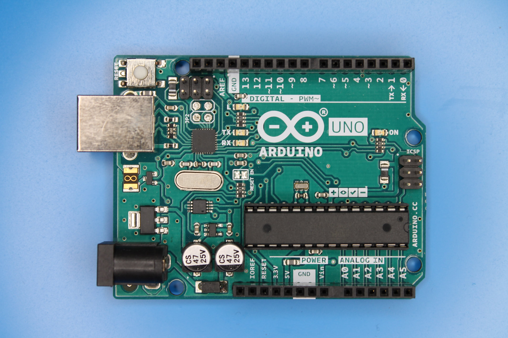
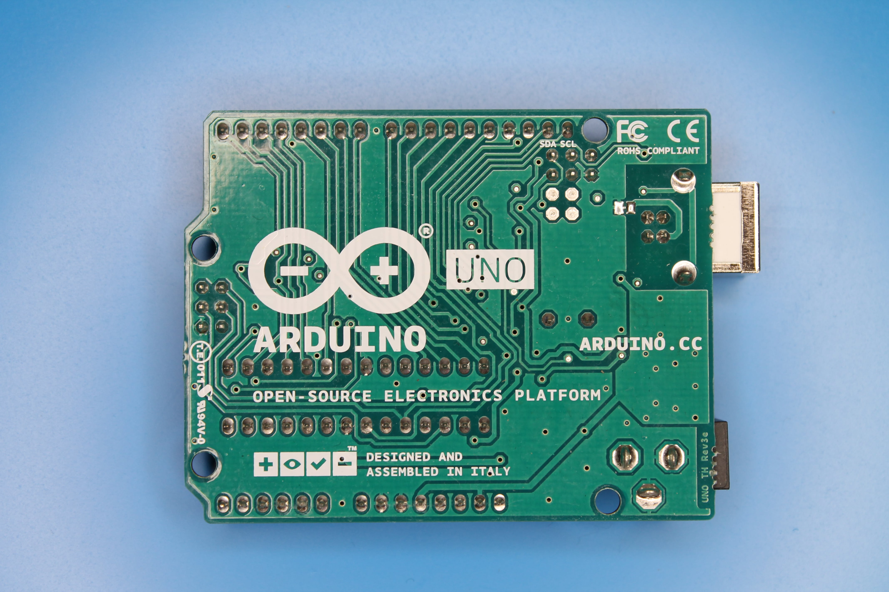
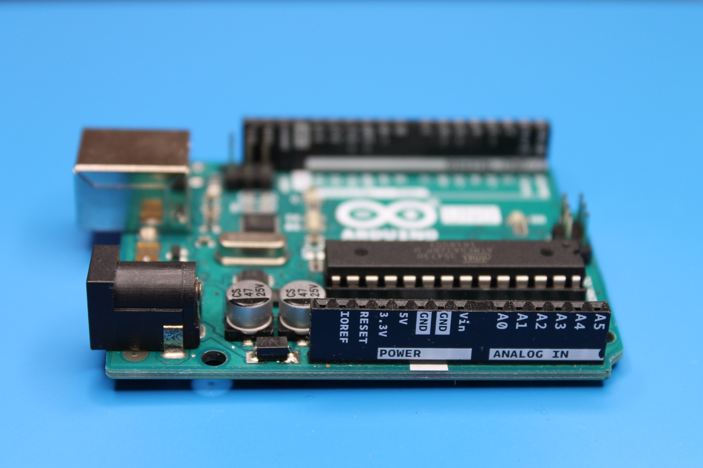
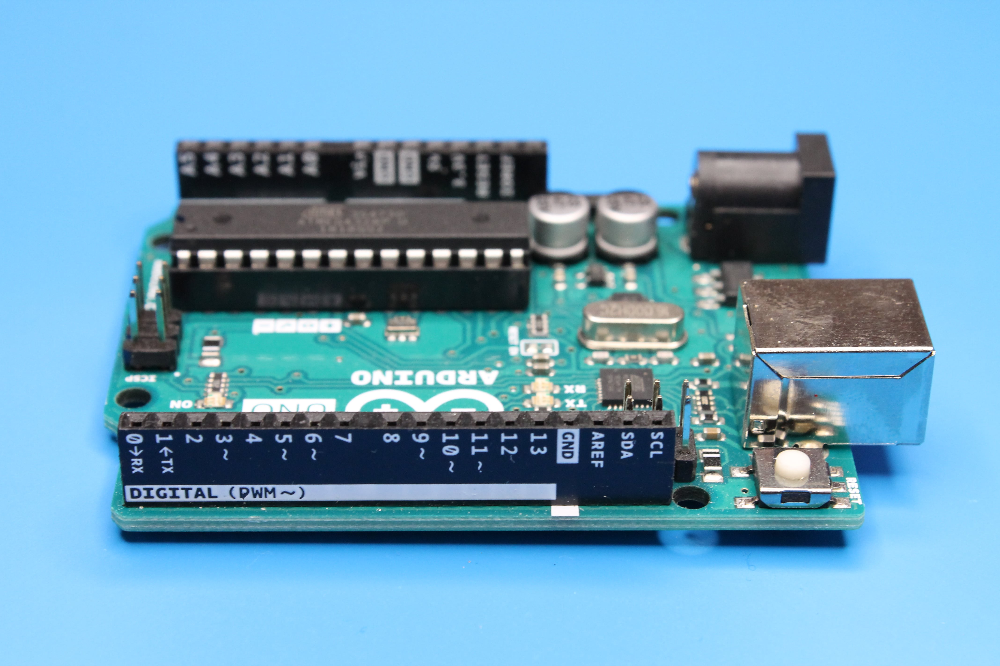

## Память

- 1 Кб электрически стираемой программируемой постоянной памяти (EEPROM).
- 2 Кб энергозависимой памяти оперативного запоминающего устройства (ОЗУ) под хранение переменных.
- 32 Кб флеш-памяти для записи программ.

## Питание (Power)

Питание платы осуществляется через USB или разъем внешнего блока питания (от 7,5 до 12 В). Сама плата Arduino потребляет 50 mA.

- первый контакт не подписан и зарезервирован для использования в будущем.
- **IOREF** - служит для определения опорного напряжения, на котором работает плата (на Arduino Uno это 5 В).
- **RESET** - дублирует функцию кнопки сброса. Чтобы выполнить сброс, необходимо кратковременно замкнуть этот контакт на землю (GND).
- **3.3V** - выводит электропитание с уровнем напряжения в 3.3 В
- **5V** - выводит электропитание с уровнем напряжения в 5 В
- **GND** - (Ground, земля) - выводит электропитание с уровнем напряжения в 0 В

## Аналоговые входы (Analog input)

- **A0-A5** - на плате расположены 6 аналоговых входов предназначенных для измерения напряжения. Эти контакты можно использовать и как цифровые входы-выходы, но по умолчанию они действуют как аналоговые входы.

## Цифровые выходы (Digital output)

- **0-13** - контакты которые можно использовать как цифровые входы или выходы. Цифровые выходы могут отдавать ток до 40 мА с напряжением 5 В. Контакты 0 (RX) и 1 (TX) используются для подключения к компьютеру или другим устройствам через последовательный порт. Контакты 2 и 3 могут обрабатывать внешние прерывания, соответствуют прерываниям 0 и 1.
- **PWM~** - контакты, отмеченные значком `~` (3, 5, 6, 9, 10, 11) могут работать как выходы с широтно-импульсной модуляцией (Pulse-Width Modulation, PWM). Управляя длительностью импульсов создают эффект изменения напряжения.
- **GND** - (Ground, земля) - выводит электропитание с уровнем напряжения в 0 В
- **AREF**
- **SDA** - (Serial Data Line, дублирует вывод A4) - используется для подключения устройств по шине I2C.
- **SCL** - (Serial Clock Line, дублирует вывод A5) - используется для подключения устройств по шине I2C.
