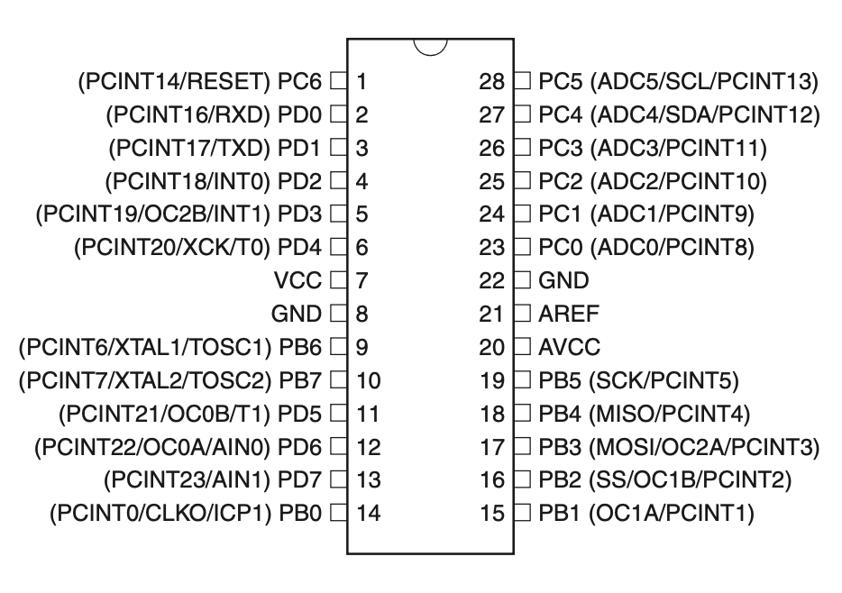
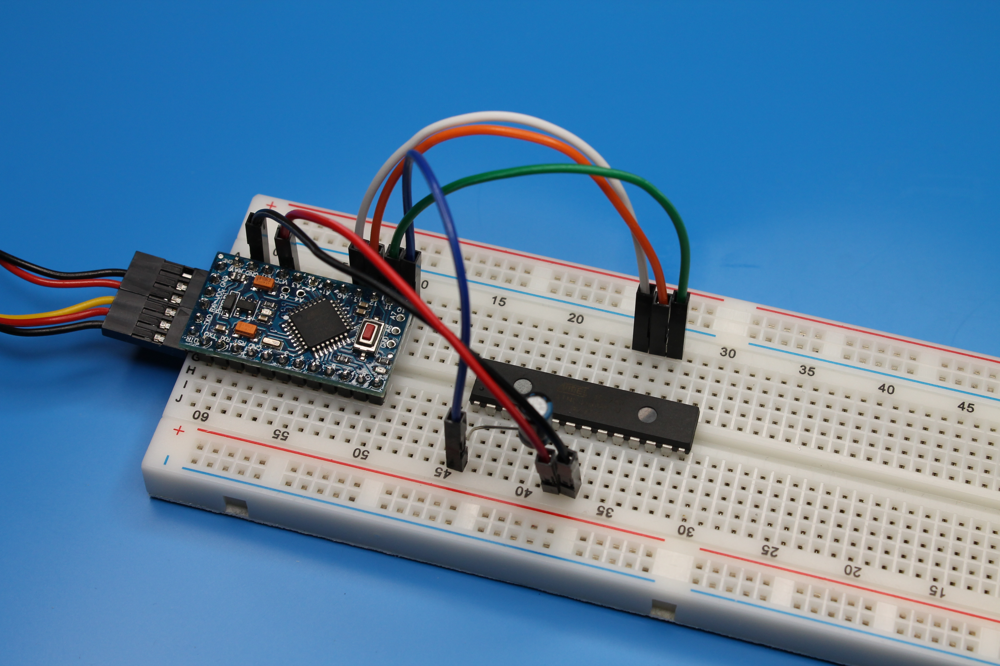
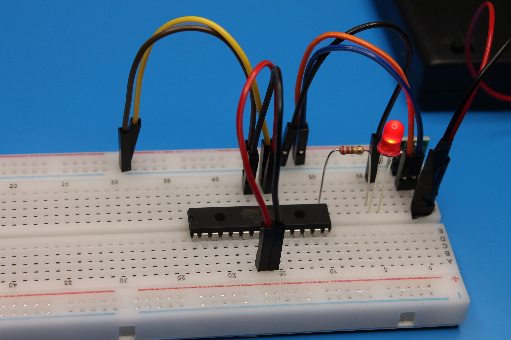

[ATmega328P](https://www.microchip.com/wwwproducts/en/ATmega328P) Высокопроизводительный 8-разрядный микроконтроллер Microchip picoPower® на базе RISC AVR® сочетает в себе 32-килобайтную флэш-память ISP с возможностями чтения во время записи, 1 KB EEPROM, 2 KB SRAM, 23 линии ввода / вывода общего назначения, 32 рабочих регистра общего назначения, три гибких таймера / счетчика с режимами сравнения, внутренние и внешние прерывания, последовательный программируемый USART, байтовый двухпроводной последовательный интерфейс, SPI последовательный порт, 6-канальный 10-разрядный аналого-цифровой преобразователь (8 каналов в пакетах TQFP и QFN / MLF), программируемый сторожевой таймер с внутренним генератором и пять программно выбираемых режимов энергосбережения. Устройство работает в диапазоне 1,8-5,5 V.

## Характеристики ATmega328P


| Параметр                            | Значение               |
| ----------------------------------- | ---------------------- |
| Тип памяти                          | Flash                  |
| Размер памяти (для записи программ) | 32 KB                  |
| Скорость CPU                        | 20 MIPS/DMIPS (20 МГц) |
| SRAM                                | 2 KB                   |
| EEPROM                              | 1 KB                   |
| ШИМ (PWM)                           | 6                      |
| Таймеры                             | 2 x 8-bit, 1 x 16-bit  |
| Диапазон температур                 | -40 - 85 °C            |
| Диапазон рабочего напряжения        | 1.8 - 5.5 V            |
| Цифровых контактов                  | 6                      |
| Аналоговых контактов                | 6                      |
| SPI                                 | 2                      |
| I2C                                 | 1                      |
| UART                                | 1                      |

MIPS (Millions of Instructions Per Second) - миллион команд в секунду.

## Схема микроконтроллера ATmega328P



## Прошивка ATmega328P с помощью Arduino

ATmega328P можно прошить с помощью UART или SPI. В данной статье будет рассматриваться прошивка через SPI, при таком подходе можно не использовать загрузчик.

### Схема подключения Arduino к ATmega328P (для прошивки)



| Arduino | ATmega328P  |
| ------- | ----------- |
| GND     | GND         |
| 3.3 V   | Vcc         |
| 13      | PB5 (SCK)   |
| 12      | PB4 (MISO)  |
| 11      | PB3 (MOSI)  |
| 10      | PC6 (RESET) |

Дополнительно для прошивки ATmega328P нужно добавить конденсатор на 10 мкФ. Более длинный (положительный) контакт конденсатора подключите к выводу RESET микроконтроллера, короткий (отрицательный) контакт конденсатора подключите к выводу GND.

### Подготовка Arduino как ISP-программатора

1. Подключить Arduino к ПК (далее будет использоваться Arduino Pro Mini);
2. Запустить Arduino IDE;
3. Загрузить ArduinoISP скетч (Файл -> Примеры -> 11.ArduinoISP -> ArduinoISP);
4. Выбрать плату Arduino, ту которую используете (Инструменты -> Плата -> Arduino AVR Boards -> Arduino Pro Mini);
5. Выбрать используемый порт (Инструменты -> Порт);
6. Нажать в панели управления Arduino IDE кнопку "Загрузка";
7. После успешной загрузки скетча, Arduino может использоваться как ISP-программатор.

### Установка загрузчика в ATmega328P

1. Добавить поддержку ATmega328P в Arduino IDE:

- Arduino -> Preferences... -> Дополнительные ссылки для менеджера плат -> Вставить `https://mcudude.github.io/MiniCore/package_MCUdude_MiniCore_index.json`
- Инструменты -> Плата -> Менеджер плат -> Ввести `MiniCore` -> Установить

2. Выбрать плату ATmega328P (Инструменты -> Плата -> MiniCore -> ATmega328)
3. Настроить плату:

- Инструменты -> Clock -> Internal 8 MHz;
- Инструменты -> BOD -> BOD 1.8V;
- Инструменты -> EEPROM -> EEPROM retained;
- Инструменты -> Compiler LTO -> LTO disabled;
- Инструменты -> Bootloader -> No bootloader;

4. Выбрать программатор (Инструменты -> Программатор -> Arduino as ISP (MiniCore));
5. Записать загрузчик (Инструменты -> Записать загрузчик);
6. В нижней части Arduino IDE появиться надпись "Запись загрузчика завершена".

### Загрузка скетча в ATmega328P

1. Создайте новый скетч и скопируйте в него содержимое ниже;
2. Выбрать плату ATmega328 (и если нужно настроить ее);
3. Выбрать программатор (Инструменты -> Программатор -> Arduino as ISP (MiniCore));

```cpp
// Мигаем светодиодом на контакте PB1 у ATmega328P
void setup() {
  pinMode(PIN_PB1, OUTPUT);
}

void loop() {
  digitalWrite(PIN_PB1, HIGH);
  delay(1000);
  digitalWrite(PIN_PB1, LOW);
  delay(1000);
}
```

4. Загрузка скетча (Скетч -> Загрузить через программатор).

### Минимальная обвязка ATmega328P

1. Используйте стабилизатор питания для питания ATmega328P, например на 3.3 V. Положительный вывод подключите к VCC, а отрицательный к GND;
2. Соедините выводы VCC и AVCC у микроконтроллера;
3. Соедините выводы GND у микроконтроллера.
4. (Не обязательно) Добавить два керамических конденсатора на 100 нФ между ножками VCC - GND и AVCC - GND.
5. (Не обязательно) Между RESET и VCC установить резистор на 10 кОм (для защиты от непреднамеренного сброса).


