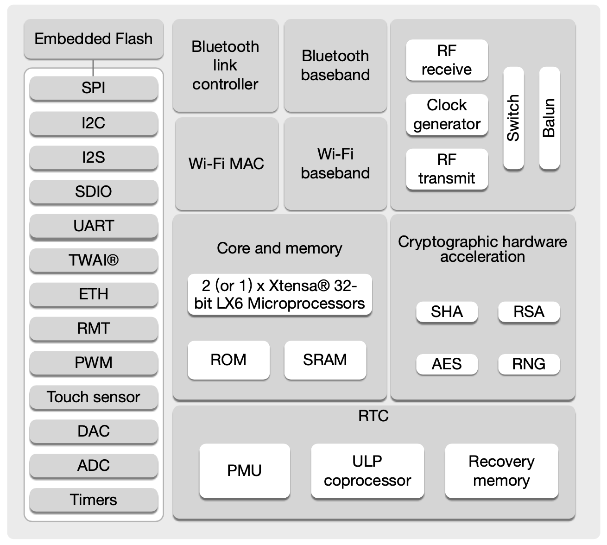
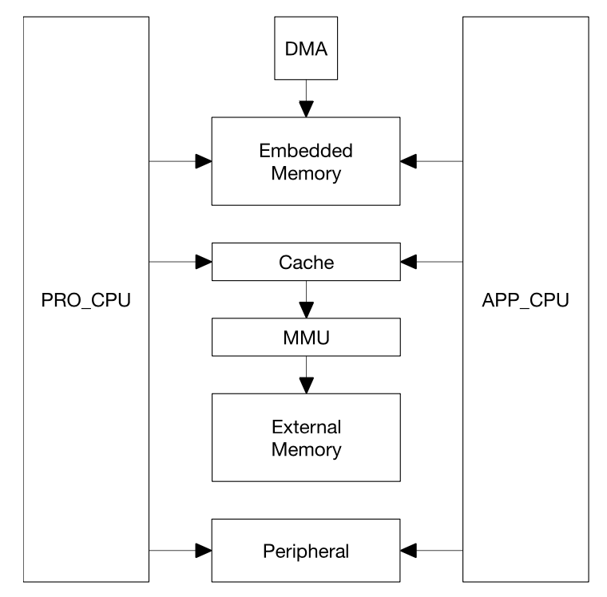
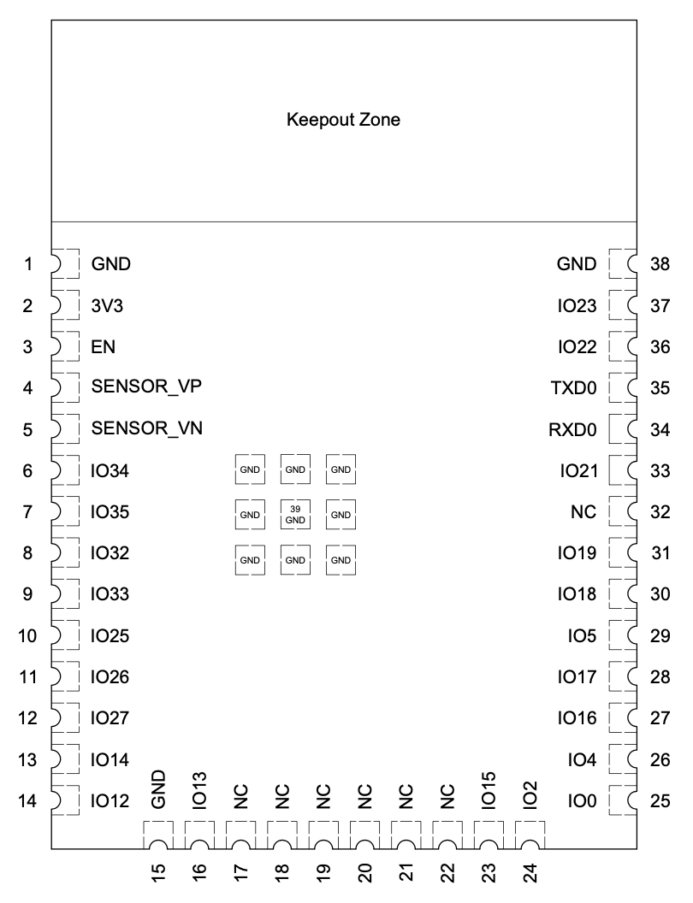
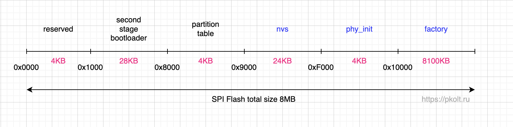
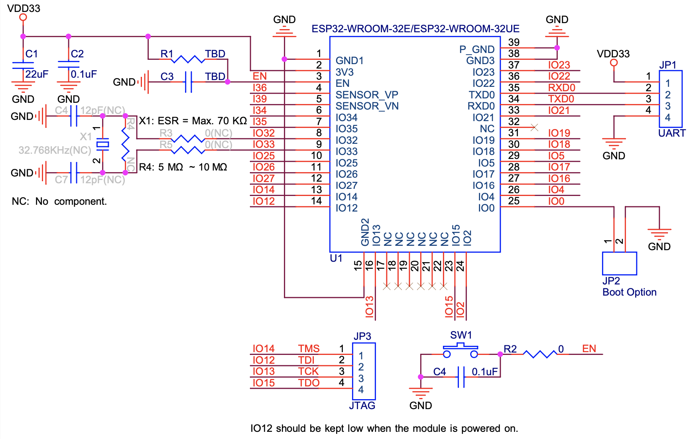

В данной статье будет рассмотрен модуль ESP32-WROOM-32E и его вариация ESP32-WROOM-32UE с внешней антенной. Модуль разработан китайской компанией Espressif Systems находящейся в Шанхае.

ESP32 это мощный, универсальный модуль с поддержкой Wi-Fi и Bluetooth. Модуль предназначен для для широкого спектра приложений, начиная от маломощных [сенсорных сетей](https://ru.wikipedia.org/wiki/%D0%91%D0%B5%D1%81%D0%BF%D1%80%D0%BE%D0%B2%D0%BE%D0%B4%D0%BD%D0%B0%D1%8F_%D1%81%D0%B5%D0%BD%D1%81%D0%BE%D1%80%D0%BD%D0%B0%D1%8F_%D1%81%D0%B5%D1%82%D1%8C) и заканчивая самыми требовательными задачами, такими как передача голоса, кодирование, потоковое воспроизведение музыки и декодирование MP3.

ESP32 можно применить в разных устройствах. Он быстрее чем 8-битные ATmega 328. Один из минусов ESP32 это большое потребление энергии при работе Wi-Fi. Для решения этой проблемы разработчики предусмотрели разные режимы пониженного энергопотребления.

## Технические характеристики ESP32



| Свойство             | Значение                                  |
| -------------------- | ----------------------------------------- |
| Чип                  | ESP32-D0WD-V3                             |
| Микропроцессор       | Xtensa dual-core 32-bit LX6, до 240 MHz   |
| Встроенная память    | 448 KB ROM, 520 KB SRAM, 16 KB SRAM в RTC |
| Внешняя память       | 4/8/16 MB SPI flash                       |
| Кварцевый осциллятор | 40 MHz                                    |
| Wi-Fi                | 802.11b/g/n                               |
| Bluetooth            | Bluetooth V4.2 BR/EDR и Bluetooth LE      |
| Рабочее напряжение   | 3.0 - 3.6 V                               |
| Кол-во GPIO выводов  | 34                                        |
| Кол-во SPI портов    | 3                                         |
| Кол-во I2S портов    | 2                                         |
| Кол-во I2C портов    | 2                                         |
| Кол-во UART портов   | 3                                         |

**448 KB ROM** (от англ. read-only memory) энергонезависимая, неизменяемая память, используется для хранения прошивки. В ROM памяти храниться так называемый "загрузчик первого уровня" ("First stage bootloader"), перезаписать его невозможно он прошивается при производстве ESP32.

**520 KB SRAM** (от анг. static random access memory) это статическая память с произвольным доступом. Доступ к любой ячейке памяти в любой момент занимает одно и то же время. Этот тип памяти является энергозависимым, после включения питания содержимое памяти становиться непредсказуемым (произвольным).

Встроенная память SRAM в RTC (16 KB) состоит из 8 KB быстрой памяти (FAST Memory) и 8 KB медленной памяти (SLOW Memory).

ESP32 содержит [eFuse память](https://docs.espressif.com/projects/esp-idf/en/latest/esp32/api-reference/system/efuse.html), состоящую из 4 блоков по 256 бит каждый. eFuse память используется для системных целей и для хранения ключей шифрования загрузчика и флеш памяти.

Микропроцессор состоит из двух одинаковых ядер: CORE_PRO (0) и CORE_APP (1). "PRO" означает "Protocol", на этом ядре обычно запускают задачи относящиеся к работе протоколов (Wi-Fi, Bluetooth). "APP" означает "Application", на этом ядре запускают задачи не относящиеся к работе сети и передачи данных. Два ядра позволяют ESP32 добиваться хорошей производительности.



## Распиновка модуля ESP32



Модуль имеет 38 контактов.

| Контакт | Описание                                                                                                                                                                                      |
| ------- | --------------------------------------------------------------------------------------------------------------------------------------------------------------------------------------------- |
| GND     | Земля                                                                                                                                                                                         |
| 3V3     | Питание 3.3 V                                                                                                                                                                                 |
| EN      | При подключении к 3.3V - модуль включается, при подключении к GND - модуль выключается. Не оставляйте этот контакт в плавающем состоянии. Этот контакт используется для сброса (перезагрузки) |
| IO0     | Используется для перевода ESP32 в режим программирования, для этого этот контакт нужно замкнуть с землей.                                                                                     |

## Загрузчик в ESP32

Многим ардуинщикам знакомо понятие загрузчика ("bootloader") который необходимо использовать в ATmega328 для прошивки через UART. В ATmega328 через SPI можно прошить новый загрузчик или вовсе удалить его (в случае если вы не планируете использовать UART).

В ESP32 используется два загрузчика:

1. Загрузчик первого уровня ("First stage bootloader") прошивается при производстве ESP32 и живет в ROM памяти. Его задача загрузить загрузчик второго уровня и передать ему управление.

2. Загрузчик второго уровня ("Second stage bootloader") прошивается когда вы заливаете новую прошивку через кабель и живет в SPI Flash памяти. Через обновление по воздуху (OTA) загрузчик залить нельзя. Загрузчик второго уровня можно кастомизировать об этом написано [в документации по ESP32](https://docs.espressif.com/projects/esp-idf/en/latest/esp32/api-guides/bootloader.html#custom-bootloader).

Оба загрузчика используются при загрузке ESP32, на этот процесс нельзя повлиять. Благодаря тому что первый загрузчик в ROM памяти неизменяем, вы не сможете превратить свой ESP32 в "кирпич" неправильной прошивкой.

О процессе загрузки ESP32 можно [прочитать в документации](https://docs.espressif.com/projects/esp-idf/en/latest/esp32/api-guides/startup.html).

## Таблица разделов флеш памяти в ESP32

Если вы используете "голый" модуль ESP32 со своей обвязкой, то скорее всего вам потребуется самостоятельно разметить таблицу разделов на SPI Flash. Также это необходимо сделать если после прошивки ESP32 вы видите неправильный размер флешки (размер флешки в байтах не соответствует вашему размеру).

Для разметки таблицы вам потребуется создать файл (`partitions.csv`) с описанием разметки.

```txt
# ESP-IDF Partition Table
# Name,   Type, SubType, Offset,  Size, Flags
nvs,      data, nvs,     0x9000,  24K,
phy_init, data, phy,     ,        4K,
factory,  app,  factory, ,        8100K,
```

Разметка состоит из: названия раздела, типа, подтипа, смещения, размера и флагов. Служебное название `factory` это место под нашу прошивку, второй загрузчик будет искать нашу прошивку по этому имени.

Раздел с именем `nvs` служит для [размещения энергонезависимого хранилища](/esp32-nvs).

Раздел с именем `phy_init` служит для размещения калибровочных данных для радиомодуля (WiFi/Bluetooth), по умолчанию на него выделяют 4 Кб. Про настройку калибровки радиомодуля подробнее можно прочитать на [сайте ESP32-IDF](https://docs.espressif.com/projects/esp-idf/en/latest/esp32/api-guides/RF_calibration.html).

Смещение это тот байт на флешке с которого начинается наш раздел. В документации по ESP32 все смещения описаны в 16-ричном формате (для удобства можно перевести в 10-ричный формат).

Как видно на рисунке ниже, есть часть разделов которые нам не нужно размечать, их разметка выполняется автоматически. Это разделы: с зарезервированным местом, вторым загрузчиком и таблицей разделов.

Если при разметке не указывать смещение, тогда оно будет вычислено автоматически.

Можно управлять началом смещения для таблицы разделов изменяя значение конфига `CONFIG_PARTITION_TABLE_OFFSET`. С помощью этой настройки можно увеличить размер загрузчика и таблицы разделов. В таком случае ваше первое смещение указываемое в файле `partitions.csv` будет равно `CONFIG_PARTITION_TABLE_OFFSET + 0x1000`.

Размеры разделов можно указывать в шестнадцатеричном формате, в десятичном в байтах, с окончанием `K` ( килобайты) или `M` (мегабайты).



Также необходимо указать путь до файла разметки в `platformio.ini`:

```ini
board_upload.flash_size = 8MB
board_upload.maximum_size=8388608
board_build.partitions = partitions.csv
```

После прошивки вы должны увидеть в консоли что размер вашей флеш памяти изменился.

Если вы укажите неправильные смещения или зададите неверные значения в размерах разделов, то увидите ошибку при прошивке. Проверьте сумму размеров ваших разделов и служебных, она не может быть больше чем размер всей флешки.

## Подключение модуля ESP32

Мы не будем использовать готовые платы разработки, а возьмем "пустой" чип ESP32 и с помощью минимальной обвязки заставим его работать.



На схеме выше приведена минимальная обвязка чипа из datasheet ESP32. Здесь нужно обратить внимание на кнопку SW1 (RESET), а также джампер JP2 (PROG/BOOT) который также можно заменить кнопкой. Резистор R1 устанавливают номиналом 10K, а конденсатор C3 номиналом 1uF. Конденсатор C1 обычно используют танталовый или электролитический, он гасит всплески потребления энергии модулем (например при включении). Компоненты обозначенные серым цветом не используются, также нам не интересен способ прошивки через JTAG.

## Прошивка модуля ESP32

Программировать ESP32 будем с помощью фреймворка [ESP-IDF](https://docs.espressif.com/projects/esp-idf/en/latest/esp32/get-started/index.html) работающего поверх операционной системы [FreeRTOS](https://www.freertos.org/). Практически запрограммировать ESP32 можно было бы и с помощью [ESP32-Arduino](https://github.com/espressif/arduino-esp32) - это официальный порт ESP-IDF под Arduino. К сожалению Arduino подобный стиль программирования не позволяет задействовать все возможности микроконтроллера ESP32, поэтому если вы хотите использовать ESP32 в полной мере, то выбирайте ESP-IDF вместо ESP32-Arduino.

Прошивать ESP32 будем в PlatformIO через UART. От UART мы будем использовать только три контакта: GND, TXD, RXD. Не советую питать ESP32 напрямую от UART, то есть подключать контакт UART 3V3 в ESP32, это не безопасно. Китайский UART модуль может просто не выдержать нагрузки создаваемой ESP32 с включенным Wi-Fi модулем, в лучшем случае сожгете USB-модуль в своем ПК, в худшем сам ПК.

Схема подключения ESP32 к UART:

| Контакт UART | Контакт ESP32 |
| ------------ | ------------- |
| GND          | GND           |
| TXD          | RXD0          |
| RXD          | TXD0          |

Для прошивки ESP32 используют две кнопки RESET и PROG (BOOT). Сначала нажимают и держат кнопку PROG, затем нажимают и отпускают кнопку RESET, после чего кнопку PROG отпускают. После этих действий запускается процесс прошивки, происходит он достаточно быстро, около пары секунд.

После завершения прошивки нам нужно вывести ESP32 из режима программирования. Для этого нам нужно нажать и отпустить кнопку RESET. Если этого не сделать то ваша новая программа не запуститься, она запускается только после перезагрузки ESP32.

В готовых ESP32 платах разработчика с встроенным USB обычно этот процесс происходит автоматически и никакие кнопки там нажимать не нужно. Но стоят они дороже голого чипа ESP32. Кроме цены схема таких плат довольно сложная, а тестировать работу ESP32 хочется ближе к тем условиям (схемам) которые будут в конечном устройстве.

Файл настройки `platformio.ini`:

Установите корректное значение размера вашей флеш памяти в ESP32 используя параметр `board_upload.flash_size`.

```ini
[env:esp32dev]
platform = espressif32
board = esp32dev
framework = espidf
monitor_speed = 115200
monitor_filters = esp32_exception_decoder

monitor_port = /dev/cu.SLAB_USBtoUART
upload_port = /dev/cu.SLAB_USBtoUART

; https://github.com/platformio/platform-espressif32/blob/master/boards/esp32dev.json
board_upload.flash_size = 8MB
```

## Мигаем светодиодом на ESP32

```c
#include "driver/gpio.h"
#include "freertos/FreeRTOS.h"
#include "freertos/task.h"

// Подключаем LED к IO2
#define LED_PIN GPIO_NUM_2

void app_main(void)
{
    gpio_pad_select_gpio(LED_PIN);
    gpio_set_direction(LED_PIN, GPIO_MODE_OUTPUT);

    for(;;) {
        gpio_set_level(LED_PIN, 1);
        vTaskDelay(1000 / portTICK_PERIOD_MS);
        gpio_set_level(LED_PIN, 0);
        vTaskDelay(1000 / portTICK_PERIOD_MS);
    }
}
```
