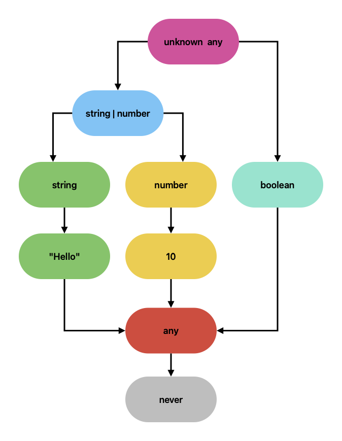

## Дженерики

### Синтаксис дженериков

```ts
type Generic<T> = {
  payload: T;
};

type StringPayload = Generic<string>;

const data: StringPayload = {
  payload: 'данные',
};
```

### Ограничение значений параметров

```ts
type Generic<T extends string> = {
  payload: T;
};

type NumberPayload = Generic<number>; // ОШИБКА (number != string)!
type StringPayload = Generic<string>;
```

### Ограничение значений параметров через другие параметры

```ts
type Generic<K extends T, T extends string> = {
  [k in K]: T;
};

const data: Generic<'foo' | 'bar', string> = {
  foo: 'value1',
  bar: 'value2',
};
```

### Ограничение параметра через самого себя

```ts
type Generic<T extends Required<T>> = T;

interface Dog {
  name: string;
  color?: string;
}

interface Cat {
  name: string;
  size: number;
}

type CarType = Generic<Dog>; // ОШИБКА (есть необязательное поле)!
type CatType = Generic<Cat>;
```

## Условные типы

```ts
type ToArray<T> = T extends any[] ? T : T[];

type T1 = ToArray<string>; // string[]
type T2 = ToArray<string[]>; // string[]
```

## Вывод типов

```ts
type ArrayItem<T> = T extends (infer U)[] ? U : never;

type Price = ArrayItem<number[]>; // number
```

## Типы шаблонных строк (Template Literal Types)

### Базовый синтаксис

```ts
type Name = 'Neo';
type Greet = `Hello ${Name}!`; // "Hello Neo!"

type Name = 'Neo' | 'Alice'; // Несколько значений
type Greet = `Hello ${Name}!`; // "Hello Neo!" | "Hello Alice!"
```

### Тип string в шаблонных строках

```ts
type Greet = `Hello ${string}!`; // аналогичен регулярному выражению /^Hello .*!$/

const val1: Greet = 'Hello!'; // ОШИБКА!
const val2: Greet = 'Hello !';
const val3: Greet = 'Hello Neo!';
```

### Тип 'true' | 'false'

```ts
type BoolAsString = `${boolean}`; // "false" | "true"
```

### Сопоставление с шаблоном

```ts
type IsGreeting<T> = T extends `Hello ${string}!` ? true : false;

type Type1 = IsGreeting<'Hello world! Really?'>; // false
type Type2 = IsGreeting<'Hello world!'>; // true
```

### Захват значения из шаблона

```ts
type GetAmount<T> = T extends `Amount: ${infer U}` ? U : never;

type Amount = GetAmount<'Amount: 10'>; // 10
```

### Тип непустой строки

```ts
type NotEmptyString = `${any}${string}`;

const val1: NotEmptyString = ''; // ОШИБКА (пустая строка)!
const val2: NotEmptyString = 'text';
```

### Тип строки ограниченной длинны

```ts
type AtLeastTwoChars = `${any}${string}${string}`; // Строка 2 или больше символов

const val1: AtLeastTwoChars = ''; // ОШИБКА!
const val2: AtLeastTwoChars = '1'; // ОШИБКА!
const val3: AtLeastTwoChars = '12';
const val4: AtLeastTwoChars = '123';
```

## Брендирование типов

### Основы

```ts
declare const kilometersBrand: unique symbol;

type Kilometers = number & {
  [kilometersBrand]: never;
};

function calculate(value: Kilometers) {
  return value * 2;
}

const kilometers = 1000 as Kilometers;
const meters = 3;

const val1 = calculate(meters); // ОШИБКА (функция принимает только километры)!
const val2 = calculate(kilometers);
```

### Фабрика брендов

```ts
declare const kilometersBrand: unique symbol;
declare const metersBrand: unique symbol;

type Brand<TType, TBrand extends symbol> = TType & { [key in TBrand]: never };

type Meters = Brand<number, typeof metersBrand>;
type Kilometers = Brand<number, typeof kilometersBrand>;

function calculate(value: Kilometers) {
  return value * 2;
}

const meters = 10 as Meters;
const kilometers = 5 as Kilometers;

calculate(meters); // ОШИБКА (функция принимает только киллометры)!
calculate(kilometers);
```

## Модификаторы полей

### Добавить readonly и optional

```ts
type ReadonlyAndOptional<T> = { readonly [K in keyof T]?: T[K] }; // Короткая запись
type ReadonlyAndOptional<T> = { +readonly [K in keyof T]+?: T[K] }; // Полная запись

interface Car {
  name: string;
  price: number;
}

const car: ReadonlyAndOptional<Car> = {
  name: 'Toyota',
  // price - необязательное поле
};

car.name = 'BMW'; // ОШИБКА (значение readonly)!
```

### Убрать readonly и optional

```ts
type NoReadonlyAndNoOptional<T> = { -readonly [K in keyof T]-?: T[K] }; // Полная запись

interface Car {
  readonly name?: string;
  readonly price?: number;
}

const obj: NoReadonlyAndNoOptional<Car> = {
  name: 'Toyota',
  price: 20000,
};

obj.name = 'Honda';
```

### Изменение имени поля

```ts
// Преобразует все ключи объекта к нижнему регистру
type KeysToLowerCase<T> = { [K in keyof T & string as Lowercase<K>]: T[K] }; // as Lowercase<K> - меняет имя поля

interface Car {
  Name: string;
  Price: number;
}

type CarFixed = KeysToLowerCase<Car>;
// Вывод:
// type CarFixed = {
//     name: string;
//     price: number;
// }
```

### Исключить поля по имени

```ts
type ExcludeKeys<T, P extends keyof T> = { [K in keyof T as K extends P ? never : K]: T[K] };

interface Props {
  name: string;
  size: number;
}

type PropsFixed = ExcludeKeys<Props, 'size'>; // {name: string}
```

## Красивый вывод комбинированных типов

```ts
interface ShortData {
  id: number;
}

interface AdditionData {
  value: string;
}

type Data = ShortData & AdditionData; // Вывод: ShortData & AdditionData
```

Решение:

```ts
interface ShortData {
  id: number;
}

interface AdditionData {
  value: string;
}

type Prettify<T> = T extends object ? { [K in keyof T]: Prettify<T[K]> } : T;

type Data = Prettify<ShortData & AdditionData>;
// Вывод:
// type Data = {
//     id: number;
//     value: string;
// }
```

> В статье использованы материалы доклада Андрея Тараненко:  
> [Видео](https://www.youtube.com/watch?v=kBwY8gc5tJU)  
> [Слайды](https://i-oktav-i.github.io/anthology-of-utilities-in-typescript/)
