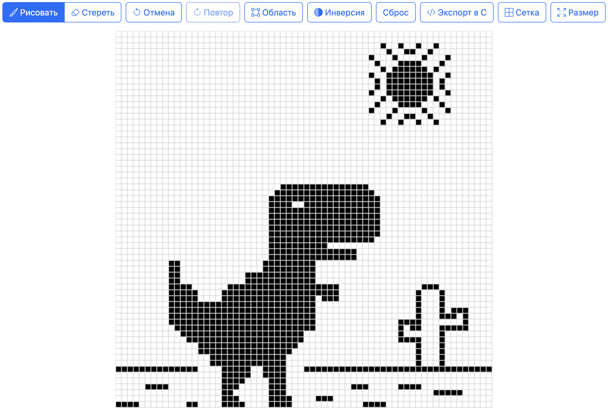
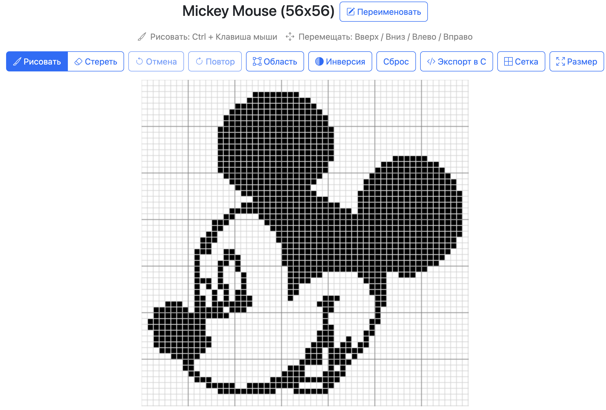
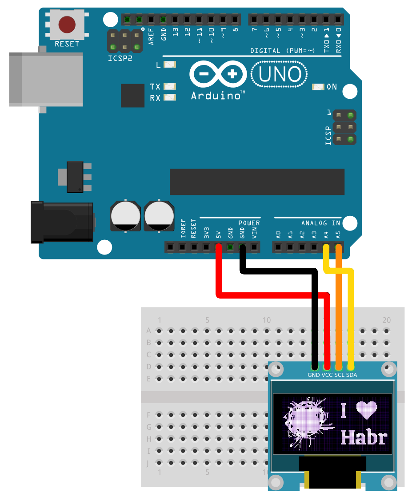
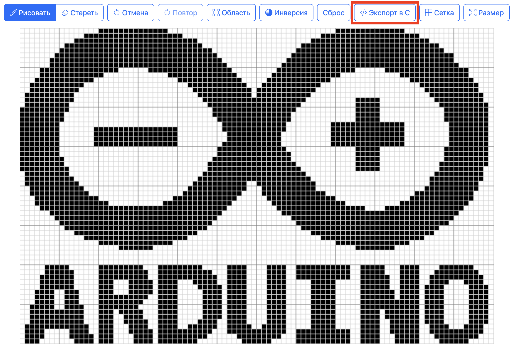
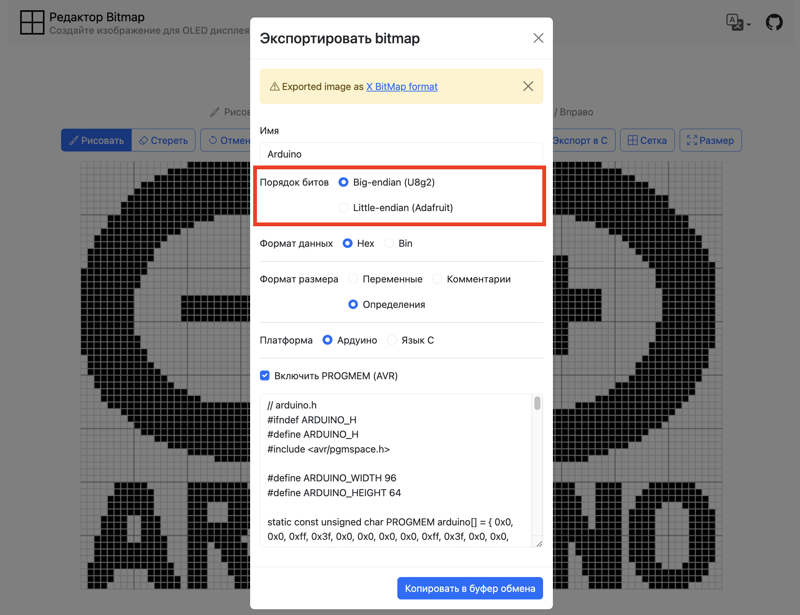
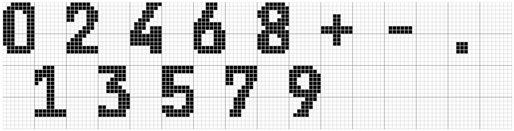
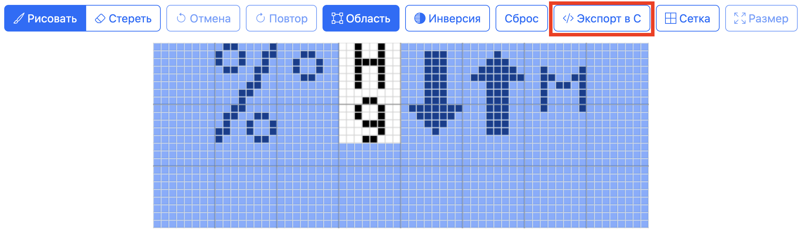

## Предыстория

Однажды мне захотелось создать очередную [метеостанцию на Arduino](https://github.com/pkolt/avr_meteo_station). Да, вы правы порой кажется что ардуинщики только и делают что создают метеостанции и мигают светодиодами.

Но моя [новая метеостанция](https://github.com/pkolt/avr_meteo_station) должна была быть написана на чистом Си без использования сторонних библиотек. Мне было интересно посмотреть насколько это сложно сделать и как сократиться размер прошивки для ATmega 328P. Это означало что мне пришлось погрузиться в спецификации подключаемых по I2C модулей и написать для них драйверы.

Одним из таких модулей, для которых я писал драйвер, был OLED-дисплей SSD1306. Про этот дисплей подробно [писали на Хабре](https://habr.com/ru/articles/741164/), поэтому не буду повторяться. Это достаточно популярный дисплей для вывода текстовой и графической информации.

Изображения в дисплей загружаются в формате [X BitMap](https://ru.wikipedia.org/wiki/X_BitMap). Подготовить изображение можно в любом графическом редакторе, а потом специальной утилитой или веб-сайтом сконвертировать его в X BitMap формат.

Этот процесс показался мне не очень удобным и сложным для новичков. Мне хотелось подготавливать картинки в одном месте. Хранить коллекцию своих монохромных изображений для OLED-дисплея и иметь возможность переслать их друзьям. Не найдя подходящего редактора, я решил написать свое приложение.

В этой статье мы рассмотрим возможности [редактора X BitMap изображений](https://github.com/pkolt/bitmap_editor), загрузку изображения в Arduino-устройство и немного поговорим о шрифтах.

Проект создан в любительских целях, рассчитан на новичков и любителей Arduino. Возможно он будет вам полезен. Также приглашаю вас поучаствовать в развитии проекта: поделиться своими идеями в [issue](https://github.com/pkolt/bitmap_editor/issues) или добавить новый функционал в редактор.

## Создание нового изображения, панель рисования

Если вы пиксель арт-художник, то возможно вам это понравится. Что может быть лучше, чем пиксельная графика на монохромном дисплее?

Заходим на [страницу редактора](https://pkolt.github.io/bitmap_editor/). 

Нажимаем на кнопку «Создать».

На странице заполните форму и нажмите кнопку «Сохранить».

Обратите внимание, что ширина изображения должна быть кратна 8 для корректного отображения на SSD1306 (а возможно, и других моделях). Это обусловлено схемой кодирования, в которой каждый сегмент страницы хранит 8 ячеек памяти.

После создания изображения вы попадёте на страницу его редактирования.

Вы можете что-то рисовать, используя правую кнопку мыши, инвертировать цвет, отменять свои действия, настраивать сетку.



Обратите внимание, что ваши правки сохраняются автоматически в локальном хранилище браузера.

Для возврата к списку ваших изображений нажмите на логотип приложения.

## Создание изображения из картинки

Возможно, у вас уже есть картинка, которую вы бы хотели отобразить на OLED-дисплее?

Тогда вам нужно зайти на [главную страницу приложения](https://pkolt.github.io/bitmap_editor/) и нажать на кнопку «Импортировать» — «Из изображения».

В форме выбираем файл вашего изображения.

Если ваша картинка выглядит не очень хорошо в монохромном виде, то вам необходимо настроить её с помощью ползунка «Чувствительность».

Менять размер картинки можно с помощью значений в полях «Ширина» и «Высота».

Если вы хотите сделать размер изображения как контур заполненных пикселей, то выберите «Обрезать».

Заполните имя изображения и нажмите кнопку «Сохранить».



## Создание изображения из коллекции иконок

Подбирать картинки для интерфейса Arduino-приложения не так-то просто и порой утомительно.  
Поэтому в редакторе есть большой набор готовых иконок, которые вы можете использовать в своём интерфейсе.

Заходим на [главную страницу приложения](https://pkolt.github.io/bitmap_editor/) и нажимаем на кнопку «Импортировать» — «Из коллекции».

Выбираем понравившуюся иконку, настраиваем и сохраняем её.

## Импорт/экспорт изображений

Как я уже писал выше, все ваши изображения хранятся в локальном хранилище в вашем браузере.

А что, если вы хотите поделиться с другом вашими любимыми bitmap-картинками?

Для этого вам нужно зайти на [главную страницу приложения](https://pkolt.github.io/bitmap_editor/) и нажать на иконку с дискетой у нужного элемента списка.

В появившемся диалоге выберите изображения для экспорта. Они будут сохранены в JSON-файл, который вы можете передать своим друзьям.

Чтобы импортировать bitmap-картинки из JSON-файла, на главной странице приложения нажмите «Импортировать» — «Из JSON».

Обратите внимание, что если вы пытаетесь импортировать изображение, которое уже есть в вашем списке, то импорт этого изображения будет проигнорирован. Каждое изображение получает уникальный идентификатор при создании.

## Загрузка изображения в Arduino

Что ж, пришло время отобразить наши изображения на OLED-дисплее в Arduino.

Схема подключения SSD1306 к Arduino UNO:

- GND (SSD1306) к GND (Arduino)
- VCC (SSD1306) к 5V (Arduino)
- SCL (SSD1306) к A5 (Arduino)
- SDA (SSD1306) к A4 (Arduino)



Заходим на [главную страницу приложения](https://pkolt.github.io/bitmap_editor/), нажимаем на нужный элемент списка.

На странице редактирования изображения нажимаем кнопку «Экспорт в C».



В диалоговом окне настраиваем параметры экспорта.

Самое важное здесь — это правильно указать «Порядок битов» в зависимости от используемой вами библиотеки OLED-дисплея: U8g2 или Adafruit.



Пример кода для U8g2:

```c
// ssd1306_u8g2.ino

#include <Arduino.h>
#include <U8g2lib.h>
#include <Wire.h>

U8G2_SSD1306_128X64_NONAME_F_HW_I2C u8g2(U8G2_R0, /* reset=*/U8X8_PIN_NONE);

#define BITMAP_WIDTH 96
#define BITMAP_HEIGHT 64

static const unsigned char PROGMEM bitmap[] = { 0x0, 0x0, 0xff, 0x3f, 0x0, 0x0, 0x0, 0x0, 0xff, 0x3f, 0x0, 0x0, 0x0, 0xe0, 0xff, 0xff, 0x1, 0x0, 0x0, 0xe0, 0xff, 0xff, 0x1, 0x0, 0x0, 0xf8, 0xff, 0xff, 0xf, 0x0, 0x0, 0xf8, 0xff, 0xff, 0x7, 0x0, 0x0, 0xfe, 0xff, 0xff, 0x1f, 0x0, 0x0, 0xfe, 0xff, 0xff, 0x1f, 0x0, 0x0, 0xff, 0xff, 0xff, 0x7f, 0x0, 0x0, 0xff, 0xff, 0xff, 0x3f, 0x0, 0x80, 0xff, 0xff, 0xff, 0xff, 0x0, 0x80, 0xff, 0xff, 0xff, 0xff, 0x0, 0xc0, 0xff, 0xff, 0xff, 0xff, 0x1, 0xc0, 0xff, 0xff, 0xff, 0xff, 0x0, 0xc0, 0xff, 0xff, 0xff, 0xff, 0x3, 0xe0, 0xff, 0xff, 0xff, 0xff, 0x1, 0xf0, 0xff, 0xf, 0xfc, 0xff, 0x7, 0xf0, 0xff, 0xf, 0xfc, 0xff, 0x7, 0xf0, 0xff, 0x1, 0xc0, 0xff, 0xf, 0xf8, 0xff, 0x1, 0xe0, 0xff, 0x7, 0xf8, 0x7f, 0x0, 0x0, 0xff, 0x1f, 0xfc, 0x7f, 0x0, 0x80, 0xff, 0xf, 0xfc, 0x1f, 0x0, 0x0, 0xfc, 0x3f, 0xfe, 0x1f, 0x0, 0x0, 0xfe, 0x1f, 0xfc, 0xf, 0x0, 0x0, 0xf8, 0x7f, 0xff, 0xf, 0x0, 0x0, 0xfc, 0x1f, 0xfe, 0x7, 0x0, 0x0, 0xf0, 0x7f, 0xff, 0x7, 0x0, 0x0, 0xf8, 0x3f, 0xfe, 0x7, 0x0, 0x0, 0xe0, 0xff, 0xff, 0x3, 0xf0, 0x1, 0xf0, 0x3f, 0xfe, 0x3, 0x0, 0x0, 0xc0, 0xff, 0xff, 0x1, 0xf0, 0x1, 0xe0, 0x7f, 0xff, 0x3, 0x0, 0x0, 0x80, 0xff, 0xff, 0x0, 0xf0, 0x1, 0xc0, 0x7f, 0xff, 0x1, 0x0, 0x0, 0x80, 0xff, 0x7f, 0x0, 0xf0, 0x1, 0xc0, 0x7f, 0xff, 0x1, 0x0, 0x0, 0x0, 0xff, 0x7f, 0x0, 0xf0, 0x1, 0xc0, 0x7f, 0xff, 0x0, 0x0, 0x0, 0x0, 0xfe, 0x3f, 0x80, 0xff, 0x3f, 0x80, 0x7f, 0xff, 0x80, 0xff, 0xff, 0x0, 0xfe, 0x3f, 0x80, 0xff, 0x3f, 0x80, 0x7f, 0xff, 0x80, 0xff, 0xff, 0x0, 0xfc, 0x1f, 0x80, 0xff, 0x3f, 0x80, 0x7f, 0xff, 0x80, 0xff, 0xff, 0x0, 0xfc, 0x1f, 0x80, 0xff, 0x3f, 0x80, 0x7f, 0xff, 0x80, 0xff, 0xff, 0x0, 0xfe, 0x1f, 0x80, 0xff, 0x3f, 0x80, 0x7f, 0xff, 0x0, 0x0, 0x0, 0x0, 0xff, 0x3f, 0x0, 0xf0, 0x1, 0xc0, 0x7f, 0xff, 0x0, 0x0, 0x0, 0x0, 0xff, 0x7f, 0x0, 0xf0, 0x1, 0xc0, 0x7f, 0xff, 0x1, 0x0, 0x0, 0x80, 0xff, 0x7f, 0x0, 0xf0, 0x1, 0xc0, 0x7f, 0xff, 0x1, 0x0, 0x0, 0xc0, 0xff, 0xff, 0x0, 0xf0, 0x1, 0xe0, 0x7f, 0xff, 0x3, 0x0, 0x0, 0xc0, 0xff, 0xff, 0x1, 0xf0, 0x1, 0xe0, 0x3f, 0xfe, 0x3, 0x0, 0x0, 0xe0, 0xff, 0xff, 0x3, 0x0, 0x0, 0xf0, 0x3f, 0xfe, 0x7, 0x0, 0x0, 0xf0, 0xff, 0xff, 0x7, 0x0, 0x0, 0xf8, 0x3f, 0xfe, 0xf, 0x0, 0x0, 0xf8, 0x3f, 0xff, 0xf, 0x0, 0x0, 0xf8, 0x1f, 0xfc, 0x1f, 0x0, 0x0, 0xfc, 0x3f, 0xfe, 0xf, 0x0, 0x0, 0xfc, 0x1f, 0xfc, 0x3f, 0x0, 0x0, 0xfe, 0x1f, 0xfe, 0x3f, 0x0, 0x0, 0xff, 0xf, 0xf8, 0xff, 0x0, 0x80, 0xff, 0xf, 0xfc, 0xff, 0x0, 0x80, 0xff, 0xf, 0xf8, 0xff, 0x3, 0xe0, 0xff, 0x7, 0xf8, 0xff, 0x3, 0xe0, 0xff, 0x7, 0xf0, 0xff, 0xff, 0xff, 0xff, 0x3, 0xf0, 0xff, 0x3f, 0xfc, 0xff, 0x3, 0xc0, 0xff, 0xff, 0xff, 0xff, 0x1, 0xe0, 0xff, 0xff, 0xff, 0xff, 0x1, 0x80, 0xff, 0xff, 0xff, 0xff, 0x0, 0x80, 0xff, 0xff, 0xff, 0xff, 0x0, 0x0, 0xff, 0xff, 0xff, 0x7f, 0x0, 0x0, 0xff, 0xff, 0xff, 0x7f, 0x0, 0x0, 0xfe, 0xff, 0xff, 0x3f, 0x0, 0x0, 0xfe, 0xff, 0xff, 0x1f, 0x0, 0x0, 0xf8, 0xff, 0xff, 0xf, 0x0, 0x0, 0xf8, 0xff, 0xff, 0xf, 0x0, 0x0, 0xe0, 0xff, 0xff, 0x3, 0x0, 0x0, 0xe0, 0xff, 0xff, 0x3, 0x0, 0x0, 0x0, 0xff, 0x7f, 0x0, 0x0, 0x0, 0x0, 0xff, 0x7f, 0x0, 0x0, 0x0, 0x0, 0xf0, 0x7, 0x0, 0x0, 0x0, 0x0, 0xf0, 0xf, 0x0, 0x0, 0x0, 0x0, 0x0, 0x0, 0x0, 0x0, 0x0, 0x0, 0x0, 0x0, 0x0, 0x0, 0x0, 0x0, 0x0, 0x0, 0x0, 0x0, 0x0, 0x0, 0x0, 0x0, 0x0, 0x0, 0x0, 0x0, 0x0, 0x0, 0x0, 0x0, 0x0, 0x0, 0x0, 0x0, 0x0, 0x0, 0xe0, 0x3, 0xff, 0xf1, 0x1f, 0x3c, 0x3c, 0xff, 0xe7, 0xe3, 0xe1, 0xf, 0xe0, 0x7, 0xff, 0xf3, 0x7f, 0x3c, 0x3c, 0xff, 0xe7, 0xe3, 0xf1, 0x1f, 0xf0, 0x7, 0xff, 0xf3, 0xff, 0x3c, 0x3c, 0xff, 0xe7, 0xe7, 0xf9, 0x3f, 0xf0, 0x7, 0xc7, 0xf7, 0xf8, 0x3c, 0x3c, 0xf8, 0xe0, 0xe7, 0x79, 0x3c, 0xf0, 0x7, 0xc7, 0xf7, 0xf0, 0x3d, 0x3c, 0xf8, 0xe0, 0xe7, 0x3d, 0x78, 0x78, 0xe, 0xc7, 0xf7, 0xe0, 0x3d, 0x3c, 0xf8, 0xe0, 0xef, 0x3d, 0x78, 0x78, 0xe, 0xff, 0xf3, 0xe0, 0x3d, 0x3c, 0xf8, 0xe0, 0xef, 0x3d, 0x78, 0x78, 0xe, 0xff, 0xf1, 0xe0, 0x3d, 0x3c, 0xf8, 0xe0, 0xff, 0x3d, 0x78, 0x7c, 0x1e, 0xff, 0xf0, 0xe0, 0x3d, 0x3c, 0xf8, 0xe0, 0xff, 0x3d, 0x78, 0xfc, 0x1f, 0xf7, 0xf1, 0xe0, 0x3d, 0x3c, 0xf8, 0xe0, 0xfd, 0x3d, 0x78, 0xfc, 0x1f, 0xe7, 0xf1, 0xe0, 0x3d, 0x3c, 0xf8, 0xe0, 0xfd, 0x3d, 0x78, 0xfc, 0x1f, 0xe7, 0xf3, 0xf0, 0x3c, 0x3c, 0xf8, 0xe0, 0xf9, 0x3d, 0x78, 0xfe, 0x3f, 0xc7, 0xf3, 0xfc, 0x7c, 0x3e, 0xf8, 0xe0, 0xf9, 0x79, 0x3c, 0x1e, 0x3c, 0xc7, 0xf7, 0x7f, 0xfc, 0x3f, 0xff, 0xe7, 0xf9, 0xf9, 0x3f, 0x1e, 0x7c, 0x87, 0xf7, 0x3f, 0xf0, 0x1f, 0xff, 0xe7, 0xf1, 0xf1, 0x1f, 0xe, 0x78, 0x87, 0xf7, 0xf, 0xe0, 0x7, 0xff, 0xe7, 0xf1, 0xe1, 0x7 };

void setup(void) {
  if (!u8g2.begin()) {
    Serial.println(F("SSD1306 allocation failed"));
    for (;;) {
      // Don't proceed, loop forever
    }
  };

  u8g2.clearDisplay();
  u8g2.drawXBMP(16, 0, BITMAP_WIDTH, BITMAP_HEIGHT, bitmap);
  u8g2.sendBuffer();
}

void loop(void) {}
```

Пример кода для Adafruit:

```c
// ssd1306_adafruit.ino

#include <Wire.h>
#include <Adafruit_GFX.h>
#include <Adafruit_SSD1306.h>
#include <avr/pgmspace.h>

#define SCREEN_WIDTH 128  // OLED display width, in pixels
#define SCREEN_HEIGHT 64  // OLED display height, in pixels

#define OLED_RESET -1        // Reset pin # (or -1 if sharing Arduino reset pin)
#define SCREEN_ADDRESS 0x3C  ///< See datasheet for Address; 0x3D for 128x64, 0x3C for 128x32
Adafruit_SSD1306 display(SCREEN_WIDTH, SCREEN_HEIGHT, &Wire, OLED_RESET);

#define BITMAP_WIDTH 96
#define BITMAP_HEIGHT 64

static const unsigned char PROGMEM bitmap[] = { 0x0, 0x0, 0xff, 0xfc, 0x0, 0x0, 0x0, 0x0, 0xff, 0xfc, 0x0, 0x0, 0x0, 0x7, 0xff, 0xff, 0x80, 0x0, 0x0, 0x7, 0xff, 0xff, 0x80, 0x0, 0x0, 0x1f, 0xff, 0xff, 0xf0, 0x0, 0x0, 0x1f, 0xff, 0xff, 0xe0, 0x0, 0x0, 0x7f, 0xff, 0xff, 0xf8, 0x0, 0x0, 0x7f, 0xff, 0xff, 0xf8, 0x0, 0x0, 0xff, 0xff, 0xff, 0xfe, 0x0, 0x0, 0xff, 0xff, 0xff, 0xfc, 0x0, 0x1, 0xff, 0xff, 0xff, 0xff, 0x0, 0x1, 0xff, 0xff, 0xff, 0xff, 0x0, 0x3, 0xff, 0xff, 0xff, 0xff, 0x80, 0x3, 0xff, 0xff, 0xff, 0xff, 0x0, 0x3, 0xff, 0xff, 0xff, 0xff, 0xc0, 0x7, 0xff, 0xff, 0xff, 0xff, 0x80, 0xf, 0xff, 0xf0, 0x3f, 0xff, 0xe0, 0xf, 0xff, 0xf0, 0x3f, 0xff, 0xe0, 0xf, 0xff, 0x80, 0x3, 0xff, 0xf0, 0x1f, 0xff, 0x80, 0x7, 0xff, 0xe0, 0x1f, 0xfe, 0x0, 0x0, 0xff, 0xf8, 0x3f, 0xfe, 0x0, 0x1, 0xff, 0xf0, 0x3f, 0xf8, 0x0, 0x0, 0x3f, 0xfc, 0x7f, 0xf8, 0x0, 0x0, 0x7f, 0xf8, 0x3f, 0xf0, 0x0, 0x0, 0x1f, 0xfe, 0xff, 0xf0, 0x0, 0x0, 0x3f, 0xf8, 0x7f, 0xe0, 0x0, 0x0, 0xf, 0xfe, 0xff, 0xe0, 0x0, 0x0, 0x1f, 0xfc, 0x7f, 0xe0, 0x0, 0x0, 0x7, 0xff, 0xff, 0xc0, 0xf, 0x80, 0xf, 0xfc, 0x7f, 0xc0, 0x0, 0x0, 0x3, 0xff, 0xff, 0x80, 0xf, 0x80, 0x7, 0xfe, 0xff, 0xc0, 0x0, 0x0, 0x1, 0xff, 0xff, 0x0, 0xf, 0x80, 0x3, 0xfe, 0xff, 0x80, 0x0, 0x0, 0x1, 0xff, 0xfe, 0x0, 0xf, 0x80, 0x3, 0xfe, 0xff, 0x80, 0x0, 0x0, 0x0, 0xff, 0xfe, 0x0, 0xf, 0x80, 0x3, 0xfe, 0xff, 0x0, 0x0, 0x0, 0x0, 0x7f, 0xfc, 0x1, 0xff, 0xfc, 0x1, 0xfe, 0xff, 0x1, 0xff, 0xff, 0x0, 0x7f, 0xfc, 0x1, 0xff, 0xfc, 0x1, 0xfe, 0xff, 0x1, 0xff, 0xff, 0x0, 0x3f, 0xf8, 0x1, 0xff, 0xfc, 0x1, 0xfe, 0xff, 0x1, 0xff, 0xff, 0x0, 0x3f, 0xf8, 0x1, 0xff, 0xfc, 0x1, 0xfe, 0xff, 0x1, 0xff, 0xff, 0x0, 0x7f, 0xf8, 0x1, 0xff, 0xfc, 0x1, 0xfe, 0xff, 0x0, 0x0, 0x0, 0x0, 0xff, 0xfc, 0x0, 0xf, 0x80, 0x3, 0xfe, 0xff, 0x0, 0x0, 0x0, 0x0, 0xff, 0xfe, 0x0, 0xf, 0x80, 0x3, 0xfe, 0xff, 0x80, 0x0, 0x0, 0x1, 0xff, 0xfe, 0x0, 0xf, 0x80, 0x3, 0xfe, 0xff, 0x80, 0x0, 0x0, 0x3, 0xff, 0xff, 0x0, 0xf, 0x80, 0x7, 0xfe, 0xff, 0xc0, 0x0, 0x0, 0x3, 0xff, 0xff, 0x80, 0xf, 0x80, 0x7, 0xfc, 0x7f, 0xc0, 0x0, 0x0, 0x7, 0xff, 0xff, 0xc0, 0x0, 0x0, 0xf, 0xfc, 0x7f, 0xe0, 0x0, 0x0, 0xf, 0xff, 0xff, 0xe0, 0x0, 0x0, 0x1f, 0xfc, 0x7f, 0xf0, 0x0, 0x0, 0x1f, 0xfc, 0xff, 0xf0, 0x0, 0x0, 0x1f, 0xf8, 0x3f, 0xf8, 0x0, 0x0, 0x3f, 0xfc, 0x7f, 0xf0, 0x0, 0x0, 0x3f, 0xf8, 0x3f, 0xfc, 0x0, 0x0, 0x7f, 0xf8, 0x7f, 0xfc, 0x0, 0x0, 0xff, 0xf0, 0x1f, 0xff, 0x0, 0x1, 0xff, 0xf0, 0x3f, 0xff, 0x0, 0x1, 0xff, 0xf0, 0x1f, 0xff, 0xc0, 0x7, 0xff, 0xe0, 0x1f, 0xff, 0xc0, 0x7, 0xff, 0xe0, 0xf, 0xff, 0xff, 0xff, 0xff, 0xc0, 0xf, 0xff, 0xfc, 0x3f, 0xff, 0xc0, 0x3, 0xff, 0xff, 0xff, 0xff, 0x80, 0x7, 0xff, 0xff, 0xff, 0xff, 0x80, 0x1, 0xff, 0xff, 0xff, 0xff, 0x0, 0x1, 0xff, 0xff, 0xff, 0xff, 0x0, 0x0, 0xff, 0xff, 0xff, 0xfe, 0x0, 0x0, 0xff, 0xff, 0xff, 0xfe, 0x0, 0x0, 0x7f, 0xff, 0xff, 0xfc, 0x0, 0x0, 0x7f, 0xff, 0xff, 0xf8, 0x0, 0x0, 0x1f, 0xff, 0xff, 0xf0, 0x0, 0x0, 0x1f, 0xff, 0xff, 0xf0, 0x0, 0x0, 0x7, 0xff, 0xff, 0xc0, 0x0, 0x0, 0x7, 0xff, 0xff, 0xc0, 0x0, 0x0, 0x0, 0xff, 0xfe, 0x0, 0x0, 0x0, 0x0, 0xff, 0xfe, 0x0, 0x0, 0x0, 0x0, 0xf, 0xe0, 0x0, 0x0, 0x0, 0x0, 0xf, 0xf0, 0x0, 0x0, 0x0, 0x0, 0x0, 0x0, 0x0, 0x0, 0x0, 0x0, 0x0, 0x0, 0x0, 0x0, 0x0, 0x0, 0x0, 0x0, 0x0, 0x0, 0x0, 0x0, 0x0, 0x0, 0x0, 0x0, 0x0, 0x0, 0x0, 0x0, 0x0, 0x0, 0x0, 0x0, 0x0, 0x0, 0x0, 0x0, 0x7, 0xc0, 0xff, 0x8f, 0xf8, 0x3c, 0x3c, 0xff, 0xe7, 0xc7, 0x87, 0xf0, 0x7, 0xe0, 0xff, 0xcf, 0xfe, 0x3c, 0x3c, 0xff, 0xe7, 0xc7, 0x8f, 0xf8, 0xf, 0xe0, 0xff, 0xcf, 0xff, 0x3c, 0x3c, 0xff, 0xe7, 0xe7, 0x9f, 0xfc, 0xf, 0xe0, 0xe3, 0xef, 0x1f, 0x3c, 0x3c, 0x1f, 0x7, 0xe7, 0x9e, 0x3c, 0xf, 0xe0, 0xe3, 0xef, 0xf, 0xbc, 0x3c, 0x1f, 0x7, 0xe7, 0xbc, 0x1e, 0x1e, 0x70, 0xe3, 0xef, 0x7, 0xbc, 0x3c, 0x1f, 0x7, 0xf7, 0xbc, 0x1e, 0x1e, 0x70, 0xff, 0xcf, 0x7, 0xbc, 0x3c, 0x1f, 0x7, 0xf7, 0xbc, 0x1e, 0x1e, 0x70, 0xff, 0x8f, 0x7, 0xbc, 0x3c, 0x1f, 0x7, 0xff, 0xbc, 0x1e, 0x3e, 0x78, 0xff, 0xf, 0x7, 0xbc, 0x3c, 0x1f, 0x7, 0xff, 0xbc, 0x1e, 0x3f, 0xf8, 0xef, 0x8f, 0x7, 0xbc, 0x3c, 0x1f, 0x7, 0xbf, 0xbc, 0x1e, 0x3f, 0xf8, 0xe7, 0x8f, 0x7, 0xbc, 0x3c, 0x1f, 0x7, 0xbf, 0xbc, 0x1e, 0x3f, 0xf8, 0xe7, 0xcf, 0xf, 0x3c, 0x3c, 0x1f, 0x7, 0x9f, 0xbc, 0x1e, 0x7f, 0xfc, 0xe3, 0xcf, 0x3f, 0x3e, 0x7c, 0x1f, 0x7, 0x9f, 0x9e, 0x3c, 0x78, 0x3c, 0xe3, 0xef, 0xfe, 0x3f, 0xfc, 0xff, 0xe7, 0x9f, 0x9f, 0xfc, 0x78, 0x3e, 0xe1, 0xef, 0xfc, 0xf, 0xf8, 0xff, 0xe7, 0x8f, 0x8f, 0xf8, 0x70, 0x1e, 0xe1, 0xef, 0xf0, 0x7, 0xe0, 0xff, 0xe7, 0x8f, 0x87, 0xe0 };

void setup() {
  Serial.begin(9600);

  // SSD1306_SWITCHCAPVCC = generate display voltage from 3.3V internally
  if (!display.begin(SSD1306_SWITCHCAPVCC, SCREEN_ADDRESS)) {
    Serial.println(F("SSD1306 allocation failed"));
    for (;;) {
      // Don't proceed, loop forever
    }
  }

  display.clearDisplay();

  display.drawBitmap(16, 0, bitmap, BITMAP_WIDTH, BITMAP_HEIGHT, SSD1306_WHITE);
  display.display();
}

void loop() {}
```

## Работа со шрифтами

Как таковой, работы со шрифтами в редакторе нет.

Но для метеостанции, которую я делал, очень нужно было отобразить показания температуры и некоторые символы.

На самом деле, дисплей SSD1306 не имеет встроенной поддержки шрифтов. Всё, что вы отображаете, — это bitmap-изображения.

Это значит, что и каждый символ шрифта — это маленькая bitmap-картинка, которая просто отображается в нужном месте дисплея.

Этот метод не подойдёт для работы библиотек U8g2 и Adafruit. Но в моём случае, поскольку я писал свой драйвер дисплея, я добавил к нему поддержку [определяемых шрифтов](https://github.com/pkolt/avr_meteo_station/blob/master/lib/fonts/numeric_font.h).

Фокус в том, что из редактора можно выгрузить в код на Си не только целое изображение, но и его часть. Таким образом, мы можем собрать свой шрифт, выгружая нужные символы.



Для этого вам нужно открыть ваше bitmap-изображение, выделить нужную область с помощью кнопки «Область» и нажать на кнопку «Экспорт в C». Будет экспортирована только выделенная часть изображения.



## Итоги

Этот редактор помог мне доделать проект метеостанции на Arduino.

В дальнейшем я планирую развивать и улучшать редактор изображений.

Возможно, в какой-то из версий будет добавлена полноценная работа со шрифтами для Arduino-библиотек.

Присоединяйтесь к развитию проекта! Поддержите проект звёздами на [GitHub](https://github.com/pkolt/bitmap_editor).

Спасибо за прочтение и удачных самоделок на Arduino!
