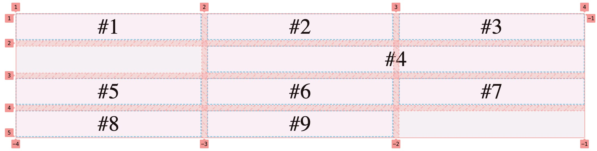
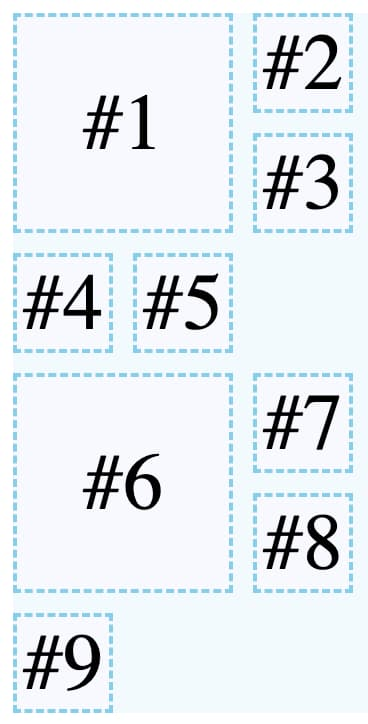
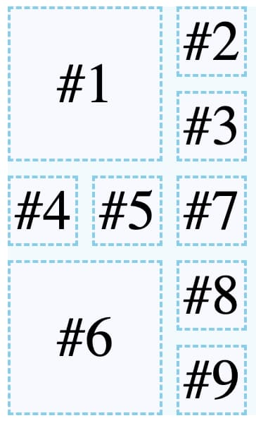
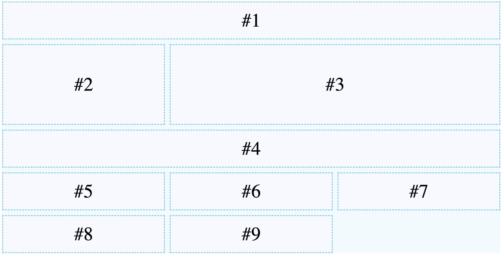
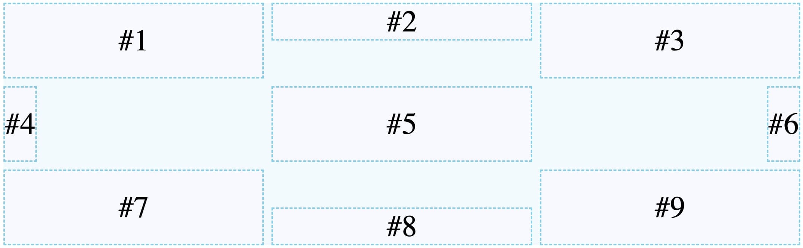
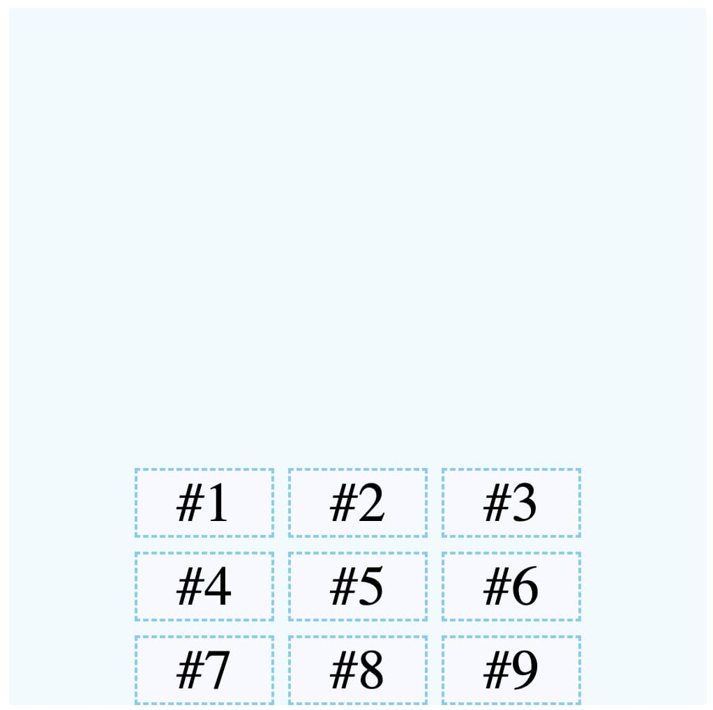
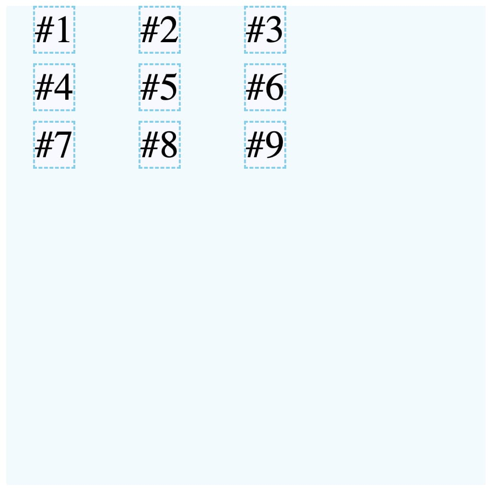

В этой статье мы рассмотрим несколько примеров использования CSS Grid, чтобы продемонстрировать его возможности и показать, как с помощью него можно легко и эффективно управлять расположением элементов на странице. Если вы хотите научиться создавать современные и адаптивные дизайны, CSS Grid - это то, что вам понадобится.

## Подготовка

Макет нашей исходной демо-страницы имеет вид (ниже мы будем добавлять CSS для его преобразования к нужному виду):


Код HTML-страницы:

```html
<!doctype html>
<html lang="en">
  <head>
    <style>
      body {
        margin: 0;
        padding: 15%;
        display: grid;
        place-content: stretch;
        box-sizing: border-box;
        min-height: 100vh;
      }

      .grid {
        background: rgba(135, 207, 235, 0.1);
        display: grid;
        grid-template-columns: repeat(3, 1fr);
        gap: 10px;
      }

      .grid-cell {
        display: flex;
        align-items: center;
        justify-content: center;
        background: ghostwhite;
        border: 2px dashed skyblue;
        font-size: 2.5rem;
      }
    </style>
  </head>
  <body>
    <div class="grid">
      <div class="grid-cell">#1</div>
      <div class="grid-cell">#2</div>
      <div class="grid-cell">#3</div>
      <div class="grid-cell">#4</div>
      <div class="grid-cell">#5</div>
      <div class="grid-cell">#6</div>
      <div class="grid-cell">#7</div>
      <div class="grid-cell">#8</div>
      <div class="grid-cell">#9</div>
    </div>
  </body>
</html>
```

## Растянуть колонку по ширине в Grid

**Как сделать первый элемент размером в 3 колонки, а третий элемент в 2 колонки?**


```css
.grid-cell:nth-child(1) {
  grid-column-start: span 3;
}

.grid-cell:nth-child(3) {
  grid-column-start: span 2;
}
```

## Отступы у колонки в Grid

**Четвертый элемент должен отступить одну колонку и занять ширину в 2 колонки.**


```css
.grid-cell:nth-child(4) {
  grid-column-start: 2; /* элемент начинается со 2-ой линии сетки */
  grid-column-end: span 2; /* элемент занимает по ширине 2 колонки  */
}
```

Номера линий сетки можно посмотреть в DevTools (Google Chrome) нажав на бейдж "grid" у элемента сетки.



Этот же результат можно получить если не использовать `span`, а опираться только на линии сетки:

```css
.grid-cell:nth-child(4) {
  grid-column-start: 2; /* начало элемента 2 линия сетки */
  grid-column-end: 4; /* конец элемента 4 линия сетки */
}

/**  или более короткая форма записи */
.grid-cell:nth-child(4) {
  grid-column: 2 / 4; /* начало 2 линия сетки, конец 4 линия сетки */
}
```

Этот же результат можно получить если использовать отрицательные номера линий сетки:

```css
.grid-cell:nth-child(4) {
  grid-column: -3 / -1;
}
```

## Порядок элементов

**Поменять местами первый и последний элементы.**


```css
.grid-cell:first-child {
  order: 1;
}

.grid-cell:last-child {
  order: -1;
}
```

## Растянуть колонку по высоте в Grid

**Необходимо сделать так, чтобы вторая колонка заняла по высоте все доступное место.**


```css
.grid-cell:nth-child(2) {
  grid-row: span 4; /* равнозначно: auto / span 4 */
}
```

Этот же результат можно получить если использовать номера линий сетки:

```css
.grid-cell:nth-child(2) {
  grid-row: 1 / 5;
  grid-column: 2;
}
```

## Количество столбцов в зависимости от ширины элемента

Иногда мы не знаем на сколько столбцов нам нужно разбить таблицу, мы хотим сделать столько столбцов сколько уместится в зависимости от ширины элемента.


```css
.grid {
  grid-template-columns: repeat(auto-fill, minmax(200px, 1fr)); /* минимальная ширина элемента равна 200px */
}
```

## auto-fill vs auto-fit

Когда элементов очень много разницу между `auto-fill` и `auto-fit` практически невозможно понять. Но когда количество элементов становиться меньше ширины таблицы, то разница становиться очевидной.

### auto-fill


```css
.grid {
  grid-template-columns: repeat(auto-fill, minmax(200px, 1fr));
}
```

### auto-fit


```css
.grid {
  grid-template-columns: repeat(auto-fit, minmax(200px, 1fr));
}
```

## Поток размещения элементов сетки

Свойство `grid-auto-flow` в CSS определяет, как новые элементы располагаются в автоматической сетке. Можно установить его значение на `row` для расположения элементов по строкам или `column` для расположения по столбцам.

```css
.grid {
  grid-template-columns: repeat(3, 50px);
  grid-template-rows: repeat(3, 50px);
  grid-auto-flow: row; /* по умолчанию */
  grid-auto-flow: dense;
  grid-auto-flow: column;
}

.grid-cell:is(:nth-child(1), :nth-child(6)) {
  grid-column: span 2;
  grid-row: span 2;
}
```

### grid-auto-flow: row



### grid-auto-flow: dense



### grid-auto-flow: column


## Области сетки

Grid Area в CSS используется для определения именованных областей в сетке. С помощью этого свойства можно назначить элементу конкретную область в сетке, указав имя области или указав начальную и конечную позиции ячеек. Это позволяет гибко располагать элементы внутри сетки и управлять их размещением на странице.



```css
.grid {
  grid-template-areas: 'header header header' 'sidebar main main' 'sidebar main main' 'footer footer footer';
  grid-auto-rows: 80px;
}

.grid-cell:nth-child(1) {
  grid-area: header;
}

.grid-cell:nth-child(2) {
  grid-area: sidebar;
}

.grid-cell:nth-child(3) {
  grid-area: main;
}

.grid-cell:nth-child(4) {
  grid-area: footer;
}
```

## Разместить элемент по центру


```css
.grid {
  grid-template-columns: initial; /* Сбросим значение заданное выше, можно это не писать если вы изначально не указывали grid-template-columns */
  place-items: center; /* короткая форма написания align-items и justify-items */
}

.grid-cell:is(:not(:first-child)) {
  display: none; /* Скроем все элементы кроме первого */
}
```

Этот же результат можно получить если использовать `justify-items` и `align-items`:

```css
.grid {
  grid-template-columns: initial; /* Сбросим значение заданное выше, можно это не писать если вы изначально не указывали grid-template-columns */
  align-items: center;
  justify-items: center;
}

.grid-cell:is(:not(:first-child)) {
  display: none; /* Скроем все элементы кроме первого */
}
```

## Выравнивание внутри области элемента сетки



```css
.grid {
  grid-auto-rows: 100px;
}

.grid-cell:nth-child(2) {
  align-self: start; /* Вверх */
}

.grid-cell:nth-child(4) {
  justify-self: start; /* Влево */
}

.grid-cell:nth-child(6) {
  justify-self: end; /* Вправо */
}

.grid-cell:nth-child(8) {
  align-self: end; /* Вниз */
}
```

## Выравнивание внутри сетки

### align-content и justify-content

Выше мы увидели, что есть свойства для выравнивания содержимого сетки (например по центру): `align-items` и `justify-items`.

Есть свойства очень похожие на них: `align-content` и `justify-content`. Разница между ними в том, что последние делают выравнивание если у таблицы есть нераспределенное пространство по горизонтали или по вертикали.



```css
.grid {
  width: 500px;
  height: 500px;
  grid-template-columns: repeat(3, 100px);
  grid-auto-rows: 50px;
  justify-content: center; /* Выравнивание по горизонтали */
  align-content: end; /* Выравнивание по вертикали */
}
```

### align-items и justify-items

С `align-items` и `justify-items` такое выравнивание не сработает.



```css
.grid {
  width: 500px;
  height: 500px;
  grid-template-columns: repeat(3, 100px);
  grid-auto-rows: 50px;
  justify-items: center;
  align-items: end;
}
```
