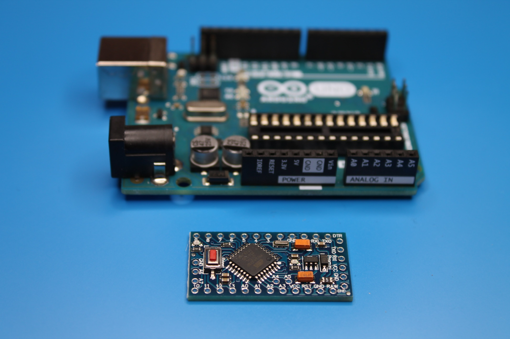
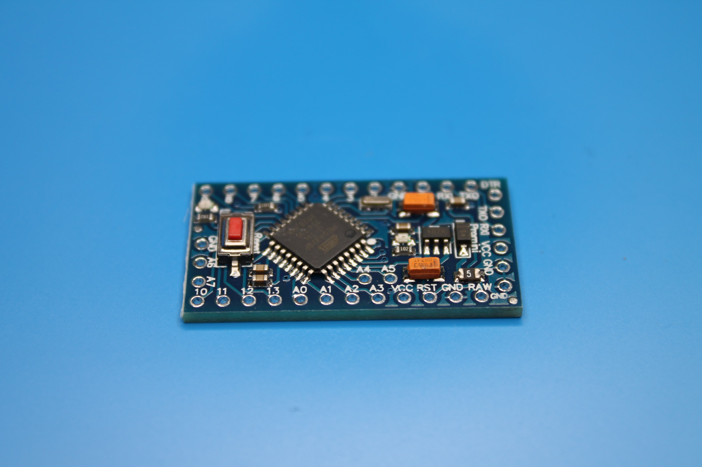
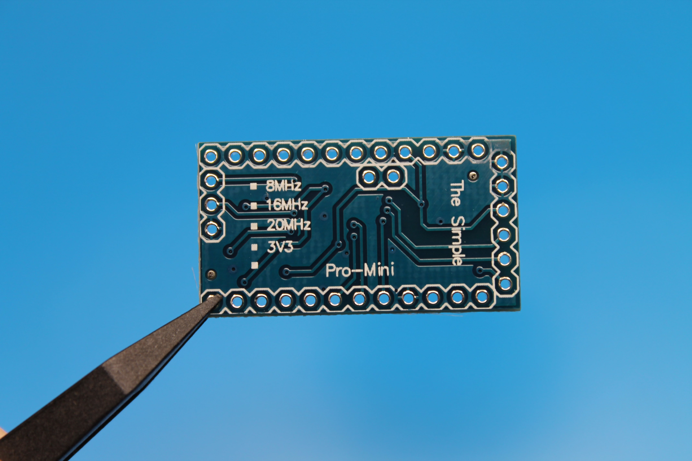
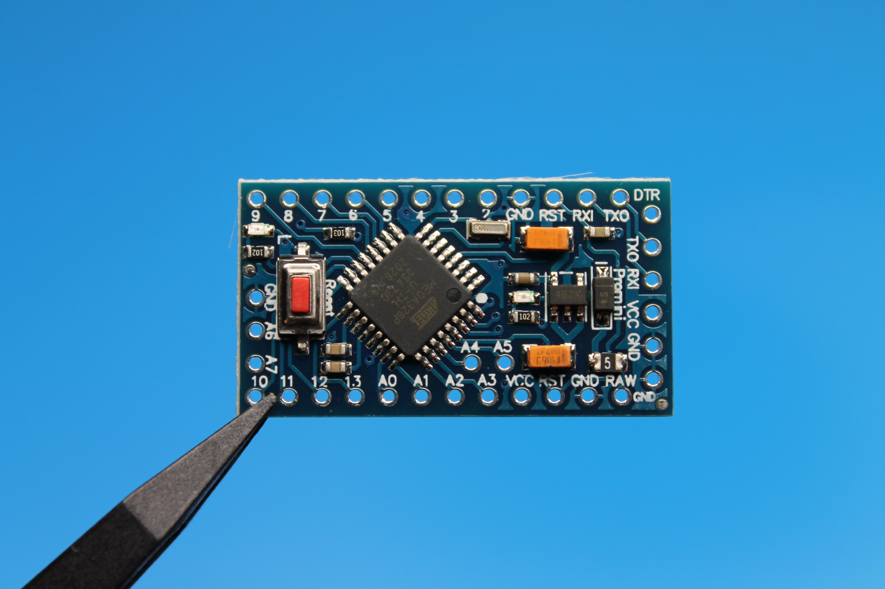

**Arduino Pro Mini** - одна из самых миниатюрных плат семейства Arduino. На рисунке ниже в сравнении: Arduino Uno (сверху) и Arduino Pro Mini (снизу).

Arduino Pro Mini выпускается в двух версиях: 3.3 V (8 MHz) и 5 V (16 MHz). Версия 3.3 V больше всего подойдет для автономных устройств на аккумуляторных батареях, она имеет очень низкое энергопотребление.

## Технические характеристики

| Свойство                                 | Значение                                                 |
| ---------------------------------------- | -------------------------------------------------------- |
| Микроконтроллер                          | ATmega328                                                |
| Питание платы                            | 3.35-12 V (для версии 3.3 V) или 5-12 V (для версии 5 V) |
| Рабочее напряжение                       | 3.3 V или 5 V (в зависимости от модели)                  |
| Кол-во цифровых контактов ввода-вывода   | 14                                                       |
| Кол-во ШИМ контактов                     | 6                                                        |
| UART                                     | 1                                                        |
| SPI                                      | 1                                                        |
| I2C                                      | 1                                                        |
| Кол-во аналоговых входов                 | 6                                                        |
| Внешние прерывания                       | 2                                                        |
| Постоянный ток на контактах ввода-вывода | 40 mA                                                    |
| Флеш память (для записи программ)        | 32 KB (2 KB из которых используются загрузчиком)         |
| SRAM                                     | 2 KB                                                     |
| EEPROM                                   | 1 KB                                                     |
| Тактовая частота                         | 8 MHz (для версии 3.3 V) или 16 MHz (для версии 5 V)     |

## Питание

Arduino Pro Mini может питаться от кабеля FTDI или коммутационной платы, подключенной к его шести контактному разъему, или от регулируемого источника питания 3,3 V или 5 V (в зависимости от модели) на контакте Vcc.

На плате есть стабилизатор напряжения, поэтому он может принимать напряжение до 12 V постоянного тока. Если вы подаете на плату нерегулируемое питание, обязательно подключайтесь к контакту RAW, а не к Vcc.

Контакты питания:

- **RAW** - для подачи нерегулируемого питания на плату (не больше 12 V);
- **Vcc** - для подачи регулируемого питания 3.3 V или 5 V (в зависимости от модели);
- **GND** - контакты заземления;

## Память

ATmega328 имеет 32 KB флэш-памяти для хранения кода (из которых 0,5 KB используется для загрузчика).

Также имеется 2 KB энергозависимой памяти оперативного запоминающего устройства под хранение переменных (SRAM) и 1 KB электрически стираемой программируемой постоянной памяти (EEPROM).

## Контакты ввода - вывода

Каждый из 14 цифровых контактов Pro Mini может использоваться как вход или выход, используя функции pinMode, digitalWrite и digitalRead. Они работают от 3.3 V или 5 V (в зависимости от модели).

Каждый вывод может обеспечивать или принимать максимум 40 мА и имеет внутренний подтягивающий резистор (по умолчанию отключен) на 20-50 кОм. Кроме того, некоторые контакты имеют специализированные функции:

- **Последовательный порт: 0 (RX) и 1 (TX)** - Используется для приема (RX) и передачи (TX) последовательных данных TTL. Эти контакты подключены к контактам TX-0 и RX-1 шести контактного разъема.

- **Внешние прерывания: 2 (прерывание 0) и 3 (прерывание 1)** - Эти выводы могут быть настроены на запуск прерывания при низком значении, нарастающем или спадающем, или изменении значения.

- **ШИМ (PWM): 3, 5, 6, 9, 10, и 11** - Эти контакты могут работать как выходы с широтно-импульсной модуляцией (Pulse-Width Modulation, PWM). Управляя длительностью импульсов создают эффект изменения напряжения.

- **SPI: 10 (SS), 11 (MOSI), 12 (MISO), 13 (SCK)** - Эти контакты поддерживают связь SPI, которая, хотя и обеспечивается базовым оборудованием, в настоящее время не включена в язык Arduino.

- **LED: 13** - К цифровому выводу 13 подключен встроенный светодиод. Когда на выводе установлено высокое значение, светодиод горит, при низком уровне - выключен.

Pro Mini имеет 8 аналоговых входов, каждый из которых обеспечивает разрешение 10 бит (т.е. 1024 различных значения). Четыре из них находятся на заголовках на краю платы; два (входы 4 и 5) на отверстиях внутри платы. Аналоговые входы измеряют расстояние от земли до Vcc. Кроме того, у некоторых контактов есть специальные функции:

- **I2C: A4 (SDA) and A5 (SCL)** - Поддержка связи I2C (TWI) с использованием библиотеки Wire.

- **Reset** - Представляет функцию кнопки сброса микроконтроллера. Чтобы выполнить сброс, необходимо кратковременно замкнуть этот контакт на землю (GND).
