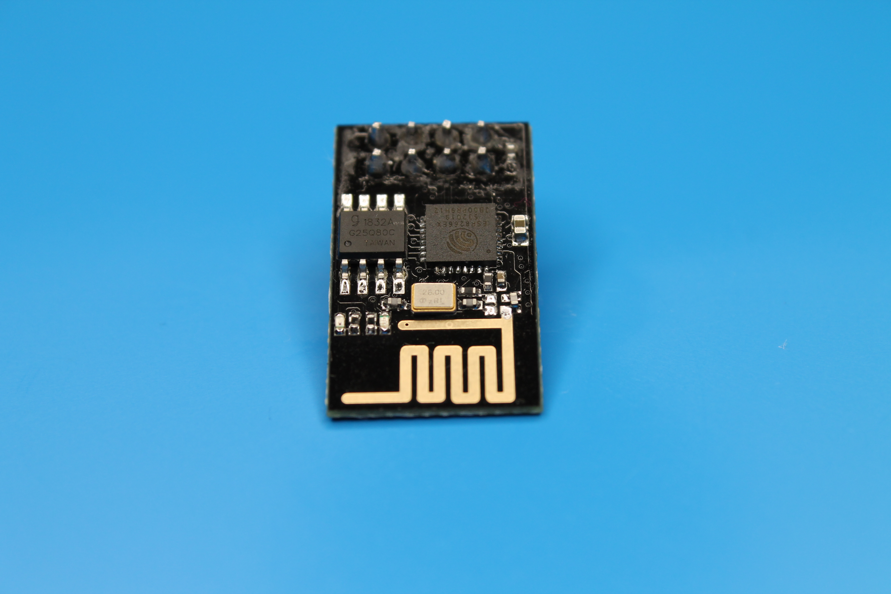
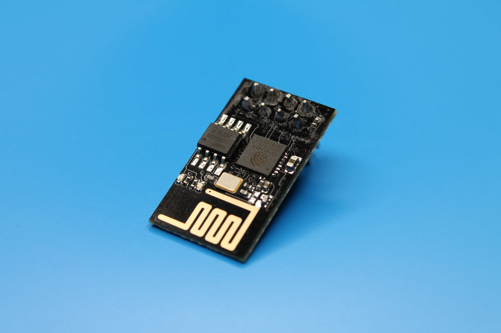
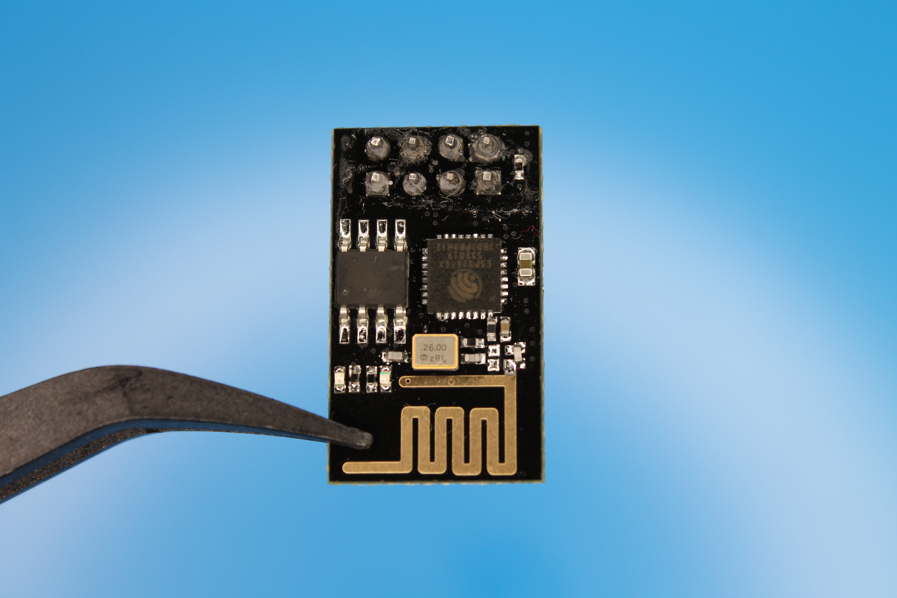

ESP-01 миниатюрный и недорогой модуль с Wi-Fi от компании [Expressif](https://www.espressif.com/), который может использоваться в устройствах умного дома.

Модуль не обязательно использовать совместно с Arduino, намного лучше использовать его как самостоятельное устройство.



## Технические характеристики

| Свойство                                 | Значение                                |
| ---------------------------------------- | --------------------------------------- |
| Микроконтроллер                          | ESP-8266EX                              |
| Питание платы                            | 3.0 - 3.6 V (только через стабилизатор) |
| Рабочее напряжение                       | 3.3 V                                   |
| Кол-во цифровых контактов ввода-вывода   | 2                                       |
| Кол-во ШИМ контактов                     | 0                                       |
| UART                                     | 1                                       |
| SPI                                      | -                                       |
| I2C                                      | 1 (для работы нужна настройка пинов)    |
| Кол-во аналоговых входов                 | 1                                       |
| Внешние прерывания                       | -                                       |
| Постоянный ток на контактах ввода-вывода | -                                       |
| Флеш память (для записи программ)        | 1 Mb                                    |
| SRAM                                     | -                                       |
| EEPROM                                   | -                                       |
| Тактовая частота                         | 80/160 MHz                              |

## Питание

ESP-01 очень прихотлив к питанию, и в среднем потребляет ток 140-200 mA при работе.

При недостаточном напряжении модуль начинает зависать и сильно нагреваться, а при слишком высоком напряжении (больше 3.6 V) может сгореть и выйти из строя.

Один из возможных вариантов питания ESP-01 при использовании совместно с аккамуляторной батареей это линейный стабилизатор напряжения. У линейного стабиллизатора напряжения не очень большое КПД, зато простое устройство, минимум обвязки и низкий ток потребления при бездействии.

Для работы с ESP-01 подойдут следующие линейные стабилизаторы:

- MCP1700
- HT 7333-A
- LM1117T

| Режим работы | Потребление тока |
| ------------ | ---------------- |
| Wi-Fi off    | 15 mA            |
| LIGHT_SLEEP  | 15 mA            |

```cpp
// Режим Wi-Fi off
WiFi.mode(WIFI_OFF);
delay(1000 * 60 * 10); // Ждем 10 минут (в миллисекундах)

// 15 mA, через 30 секунд 70 mA
WiFi.mode(WIFI_STA);
WiFi.forceSleepBegin();

delay(1000 * 30); // Ждем 30 секунд (в миллисекундах)

WiFi.forceSleepWake();

// Режим
```

## Работа в режиме глубокого сна (Deep sleep)

В режиме глубокого сна ESP-01 потребляет около 0.01 mA.

## Контакты ввода - вывода



| Pin   | Описание         |
| ----- | ---------------- |
| TX    | TXD (UART)       |
| RX    | RXD (UART)       |
| CH_PD | Включение модуля |
| RST   | Сброс            |
| VCC   | Питание 3.3 V    |
| GND   | Земля            |
| GPIO0 | IO / SCL (I2C)   |
| GPIO2 | IO / SDA (I2C)   |

Для использования контактов GPIO0 и GPIO2 в качестве I2C необходимо будет добавить в код программы переопределение этих портов для работы с I2C.

```cpp
#include <Wire.h>

void setup() {
  Wire.begin(2, 0); // Setup I2C (SDA = GPIO2, SCL = GPIO0)
}
```



## Добавление поддержки платы Wemos D1 mini в Arduino IDE

1. Запустить Arduino IDE;
2. Arduino -> Preferences -> Доп. ссылки для менеджера плат;
3. Добавить новую ссылку на плату `https://arduino.esp8266.com/stable/package_esp8266com_index.json`;
4. Инструменты -> Плата -> Менеджер плат -> Ввести "esp8266";
5. Установить плату esp8266;

Подробнее документация - [Arduino core for ESP8266 WiFi chip](https://github.com/esp8266/Arduino).

## Моргаем встроенным светодиодом на Wemos D1 mini

Создать новый скетч в Arduino IDE с текстом программы:

```cpp
void setup() {
  pinMode(LED_BUILTIN, OUTPUT);
}

void loop() {
  digitalWrite(LED_BUILTIN, LOW);
  delay(1000);
  digitalWrite(LED_BUILTIN, HIGH);
  delay(1000);
}
```

Выбрать нужную плату: Инструменты -> Плата -> ESP8266 Boards -> LOLIN (WEMOS) D1 mini (clone).

Загрузить скетч в Wemos D1 mini.
