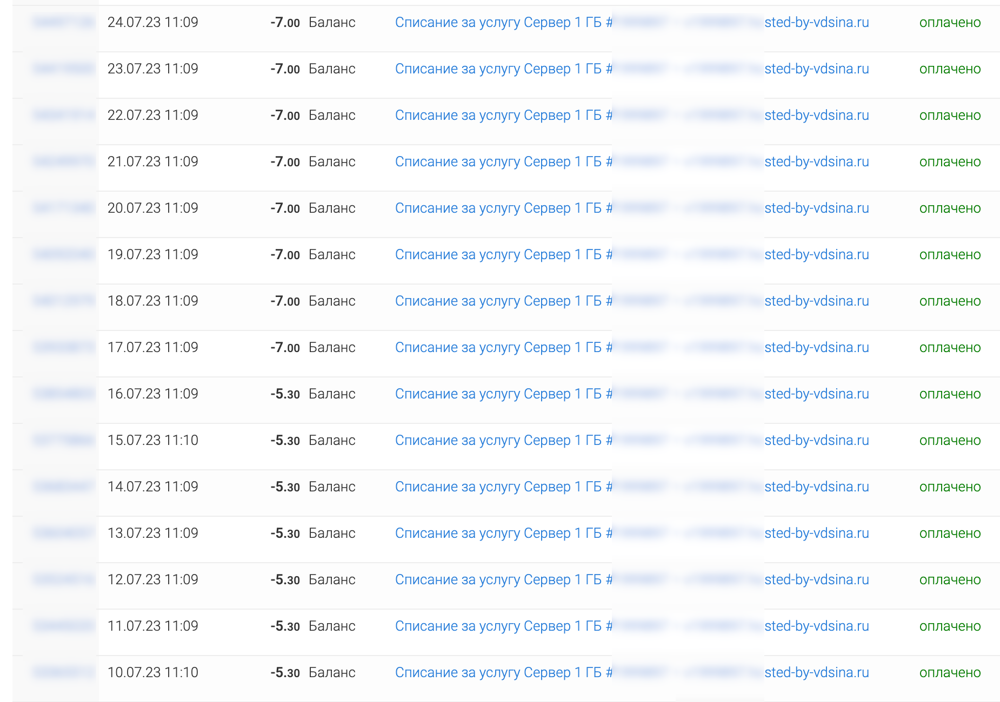
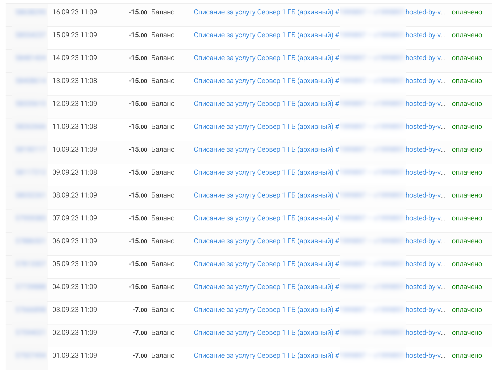
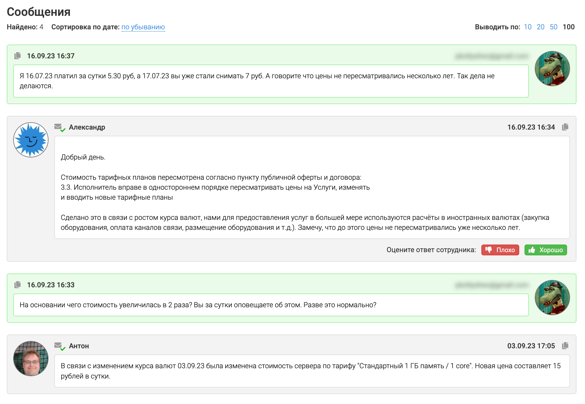
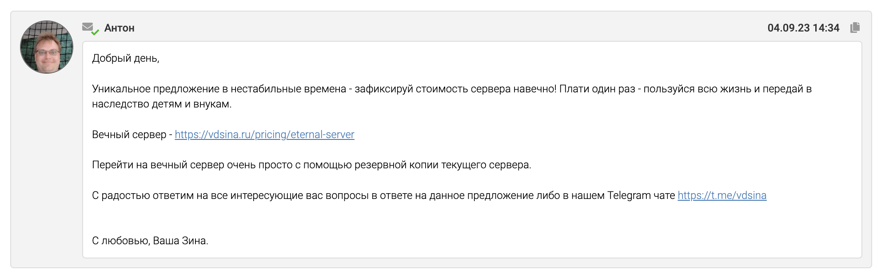

VDSina была неплохой хостинг компанией на начальном этапе. Удобная панель управления, быстрые сервера, доступные цены.

Весной 2023 года у них началось странное. На Хабре начали [жаловаться](https://habr.com/ru/news/753206/) что они спонтанно повышают цены на услуги.

Причем сначала это было повышение на рубль.

А потом они снова повысили цены уже **в два раза**!!!

Прокомментировали они это так, мол курс валюты поднялся - вот мы вам и цены подняли. Но мы это не делали уже пару лет, поэтому чего вы переживаете.

И еще как бы в насмешку (специально для тупых) посоветовали купить у них вечный VDS )))

**Больше никогда не буду пользоваться услугами VDSina, и вам не советую!**  
**Нельзя повышать цены на архивные тарифные планы как вам вздумается, это неуважение к клиентам.**
