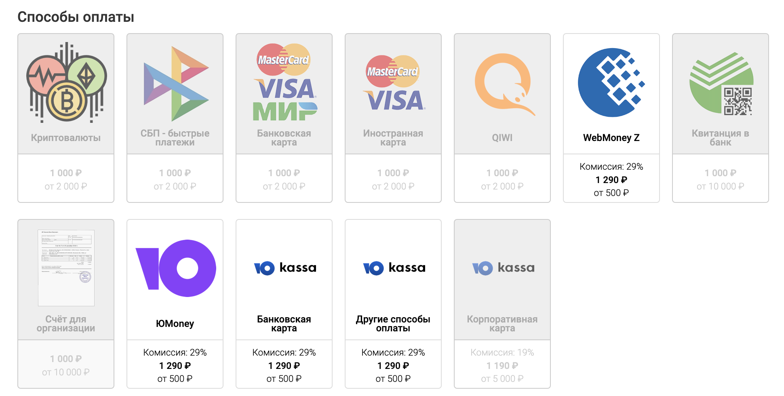
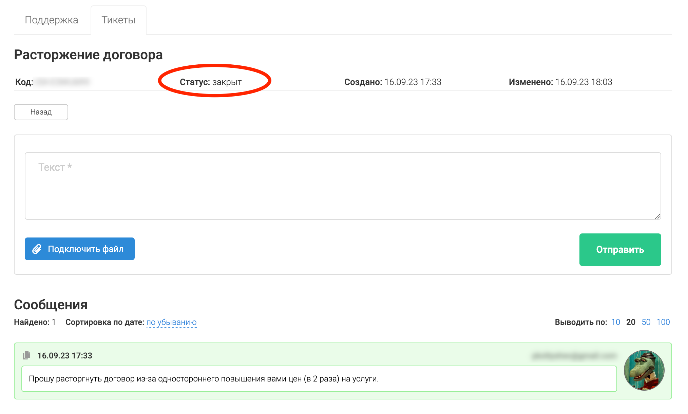
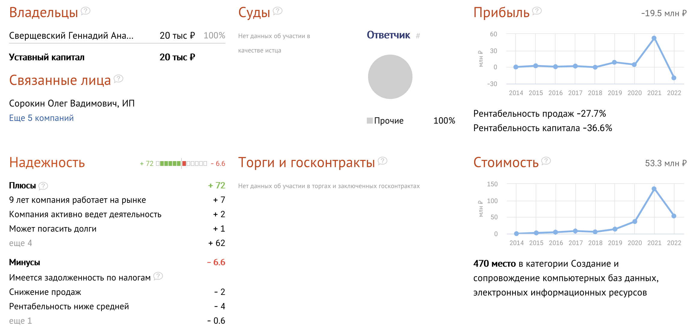
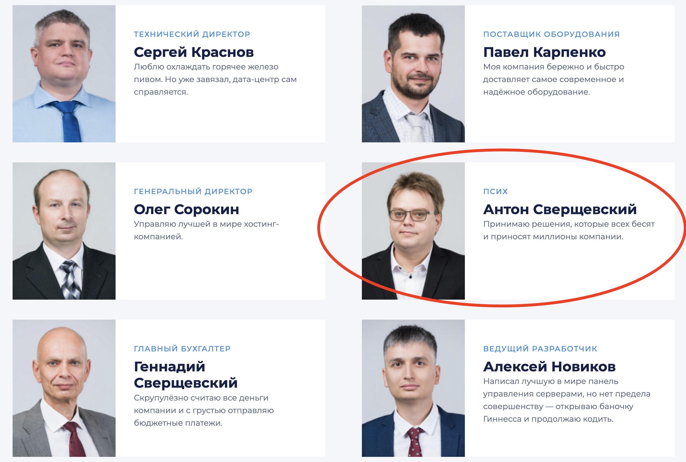

Как же они здорово [пиарились на Xабре](https://habr.com/ru/companies/vdsina/articles/) и рассказывали о том какие они хорошие. Делали скидки и заманчивые предложения по конфигурации серверов. Кто-то их даже успел посоветовать как бизнес решение, а кто-то даже купил "вечный" сервер. Кто-то участвовал в их партнерке и рекомендовал как хорошую хостинг компанию.

Но...Летом 2023 года на том же Хабре пользователи начали писать ([раз](https://habr.com/ru/news/753206/), [два](https://habr.com/ru/news/752922/)) что VDSina ставит конские комиссии на оплату услуг.

**29% комиссии за оплату услуг? А что так мало Антон?**

Кроме конских комиссии эти мега бизнесмены начали повышать цены, сначала на пару рублей:

А потом вообще в 2 раза:

Сказали что курс валют изменился, поэтому цены вам подняли. И это российская хостинг компания, которая продает сервера в России.

После всего этого, видимо в насмешку посоветовали купить у них "вечный" VDS )))

Пользователи по понятным причинам не поняли такого странного ценообразования и проголосовали ногами с этого хостинга.

**Никогда не пользуйтесь услугами VDSina (они же ООО "Хостинг-технологии") если не хотите в один прекрасный момент увидеть повышение цены на услуги в N-раз (насколько хватит фантазии у Антона).**

А если вы вдруг попались и что-то у них купили и попросите вернуть деньги назад. То можете попрощаться со своими деньгами. Они будут вас удалять из всех телеграм каналов и блокировать вас везде где только можно. Их техподдержка просто игнорирует все сообщения с вопросами о возврате денег (ваш тикет просто закроют).

Про VDSina [есть страничка на СБИС](https://sbis.ru/contragents/7721833428/772101001), можно увидеть что их прибыль в 2022 году значительно упала (почти на 20 000 000 рублей).

Ну и вы готовы что-то купить у компании в которой работает "псих"? Нет это не шутка, это они сами так [пишут](https://vdsina.ru/about) про себя.

Мне они деньги так и не вернули. Пускай подавятся ими. Зато моя статья убережет нормальных людей от потерянного времени, денег и репутации (есть люди которые их рекомендовали бизнесу).

Я использовал разные хостинг компании начиная с 2005 года, хорошие и плохие. Но такое кидалово я вижу впервые. И эти люди продолжают типа вести какой-то бизнес.

Удачи вам, надеюсь все ИТ-шники Хабра которых вы также кинули, уберегут бизнес от работы с вами.
